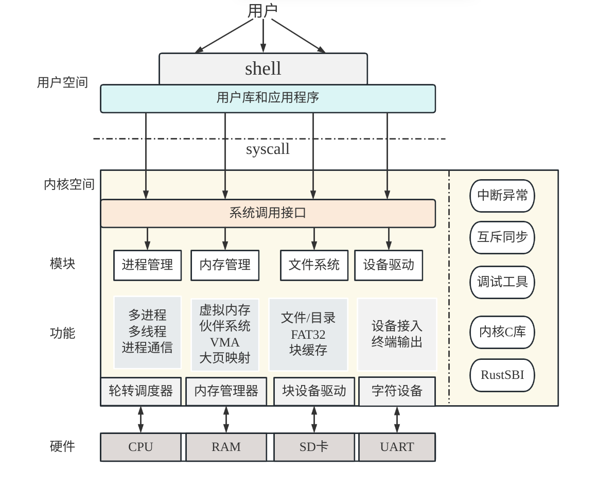
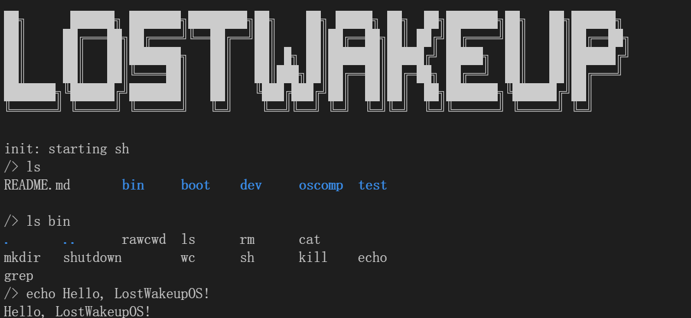

### LostWakeupOS

#### 项目简介

本项目基于xv6-riscv, 在开发过程中逐步对xv6的各个模块进行重构优化和改进， 且提供了更为丰富的系统服务。目前我们的LostWakeupOS支持了初赛要求的31个系统调用，并且通过了初赛的所有测例。


在初赛的开发过程中，部分设计思想参考了Linux内核源码和chcore, 此外, 在比赛过程中一些问题的解决思路参考了去年的参赛作品: tatakaos, 图漏图森破。


#### 内核总体框架



我们的操作系统是传统的宏内核结构，内核会封装底层硬件，并提供一组核心系统调用以便于应用程序调用。内核支持多进程、多线程以及虚拟化等常见特性，并提供一组完善的系统调用接口供用户态程序调用。

在内核的设计上，我们采用分层的结构，将内核功能按照不同的层次进行划分和抽象。最底层是硬件驱动层，负责设备驱动和硬件资源管理。中间层是操作系统服务层，提供一些常用的系统服务，例如进程管理、内存管理和文件系统。顶层是用户接口层，提供基础的用户交互和应用程序运行环境。


#### 项目组织

```
├── bootloader  # sbi
├── build		# 项目构建生成的临时文件
├── entry       # 自动化系统调用生成相关目录
├── fsimg       # 文件系统镜像
├── include     # 内核头文件
├── oscomp_user # 比赛方提供的user目录
├── scripts     # 脚本
├── src         # 内核源码
│   ├── atomic    # 互斥/同步
│   ├── driver    # 设备驱动
│   ├── fs		  # 文件系统
│   │   ├── fat32
│   │   └── vfs
│   ├── kernel    # 内核及中断处理
│   │   └── asm
│   ├── lib       # 内核中使用的库
│   ├── mm        # 内存管理
│   ├── platform  # 平台相关
│   │   └── qemu
│   ├── proc      # 进程管理
│   └── test      # 测试
└── user        # 包含了一些应用程序的user目录
```


#### 内核构建

- 在项目的根目录下通过以下命令构建整个项目并且运行os

  ```bash
  make all
  ```

- 生成文件系统镜像（FAT32）

  ```bash
  make image
  ```

  如果添加/修改了用户程序，可以通过该命令重新生成文件系统镜像

- 生成内核镜像并且启动os(确保在此之前生成了文件系统镜像)

  ```bash
  make kernel
  make
  ```

  若没有修改用户程序，仅对内核代码进行了改动，需要单独编译内核，可以使用以上两条命令之一

  此命令可以确保文件系统的持久化，不会导致先前对文件系统镜像的修改被覆盖

- 清理内核镜像

  ```bash
  make clean
  ```


- 清除所有的内核、用户编译结果以及文件系统镜像

  ```bash
  make clean-all
  ```


#### 内核支持的特性

- 虚拟文件系统 VFS

- FAT32文件系统

- 文件系统块缓存

- 伙伴系统物理内存管理

- 2MB的大页映射

- 多核物理内存分配

- Copy-On-Write

- 基于VMA的虚拟地址空间管理

- 基于等待队列的条件变量

- 内核信号量的全面应用

- 内核级别线程调度

- 高效的进程状态队列管理

- 进程家族树管理

- 优雅简洁的系统调用自动化生成


#### 初赛项目运行效果




#### 文档

**进程管理**

[进程与线程管理](doc/proc/thread_and_proc.md)


**内存管理**

[内存管理](doc/mm/memory.md)


**文件系统**

[虚拟文件系统](doc/fs/vfs.md)

[文件系统系统调用](doc/oscomp/fssyscall.md)

[FAT32底层实现](doc/fs/FAT32.md)

[文件系统块缓存](doc/fs/bcache.md)


**互斥与同步**

[原子指令](doc/atomic/atomic.md)

[条件变量](doc/atomic/cond.md)

[内核信号量](doc/atomic/semaphore.md)


**内核通用数据结构**

[list](doc/data_structure/queue.md)

[queue](doc/data_structure/queue.md)

[hash](doc/data_structure/hash.md)

[stack](doc/fs/fat32_stack.md)


**异常**

[trap](doc/misc/trap.md)


**杂项**

[misc](doc/misc/misc.md)

[debug记录](doc/misc/debug记录.md)

[type](doc/misc/types.md)

[用户初始化与用户程序](doc/misc/user.md)

[系统调用表自动化生成](doc/misc/syscall_tbl.md)


**初赛经验分享slide**

[slide](doc/slide/index.html)
> 建议clone或者下载到本地后查看


**分工**

初赛阶段

- 叶家荣：项目构建、内存管理、可执行文件的解析
- 沈铭：FAT32文件系统底层实现、进程管理、同步和互斥
- 付圣祺：虚拟文件系统，文件系统的系统调用


