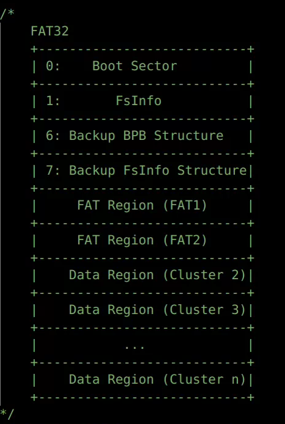
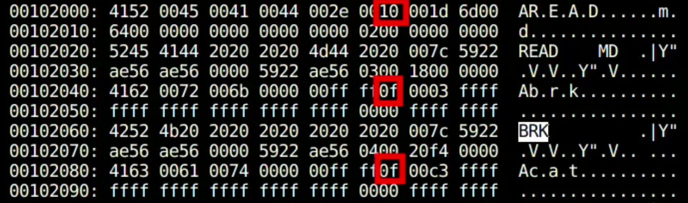

#### FAT32文件系统的磁盘分布

下面是FAT32文件系统的扇区分布情况：



这里是按照一个扇区一个扇区来进行计算，给定每个扇区大小是512B。0号扇区是Boot Sector，1号扇区是Fsinfo，6号扇区是0号扇区的一个备份，7号扇区是1号扇区的一个备份。然后是FAT表所在的区域。FAT1是主要使用的FAT所在的区域，FAT2是其对应的备份。在FAT2之后的地方就是簇号为2开始的数据区。


#### FAT32文件系统需要注意的一些点

1. 磁盘中没有单独给根目录准备一段区域，即根目录没有对应的文件控制块FCB。
2. 根目录中没有`.`和`..`，其他目录中有。
3. 一定要支持长目录项，否则无法正确获取文件名字大于11的文件。
4. 使用保留扇区的数量和FAT表的信息就可以算出数据区对应的地方。
5. FAT表的cluster0和cluster1是保留的，即实际上我们只能从cluster2开始读取。
6. FAT表的entry只有低28位有效，而高4位无效。
7. 无论是长目录项还是短目录项，都是32字节，如果第一个字节是0x00，那么代表后面的内容都是空闲的。如果第一个字节是0xE5，那么代表只能说明当前的目录项是空闲的。
8. 在磁盘中，FAT32只有DIRECTORY和非DIRECTORY两种文件，我们对于一个非目录文件，将其ATTR设置为了0x20。且对于文件的访问权限，只有READ_ONLY这一种情况。
9. 一个文件的数据块的起始簇号，需要通过将其高16位和低16位拼接的方式得到。
10. 长目录项对应的文件的名字的最大值为255，路径的最大长度为260。
11. 一个文件最多拥有20个长目录项，最后一个长目录项的Ord需要是以0x40开头。
12. 长目录项的名字字符是两个字节表示一个字符（原本应为一个字节表示一个字符），每个字符后面都跟一个空格（0x20）。
13. 为了兼容xv6代码（每个inode有一个唯一的ino），我们将根目录对应的inode对应的ino设置为了0，其他的inode的ino从1开始进行映射。在FAT32文件系统中的某个文件一定有一个短目录项，所以我们将这个短目录相对于cluster2的第一个32字节的偏移作为ino。
14. 由于FAT32的短目录项中没有专门设置设备号的字段，于是我们用DIR_NTRes这个保留字段。
15. 短目录项的DIR_FileSize对于目录文件是0，对于非目录文件就是其数据块含有内容的大小。
16. 长目录项记录的文件名的字符是正确的名字（大小写区分）。短目录项记录的文件名对应的字符全是大写，且用空格0x20填充。
17. 为了和原始的xv6进行兼容，我们保留了i_nlink。但实际上这个字段只有0和1两种取值，原因是FAT文件系统中没有hard link这个概念，只有软链接这个概念。


#### BPB（BIOS Parameter Block）和FSinfo扇区中一些重要的字段

下面是一个用Linux上的mkfs.vfat工具生成一个128MB大小，一个簇2个扇区的磁盘镜像中的部分参数：

- OEMNAME : mkfs.fat （OEM Name Identifier.）
- BytsPerSec : 512 （ Count of bytes per sector）
- SecPerClus : 2 （Number of sectors per allocation unit）
- RsvdSecCnt : 32 （Number of reserved sectors in the reserved region）
- NumFATs : 2 （The count of file allocation tables (FATs) on the volume）
- SecPerTrk : 32 （Sectors per track for interrupt 0x13）
- NumHeads : 8 （Number of heads for interrupt 0x13）
- TotSec32 : 262144 （The count of all sectors in all four regions of the volume）
- FATSz32 : 1016 （32-bit count of sectors occupied by ONE FAT）
- RootClus : 2 （Cluster number of the first cluster of the root directory）
- FSInfo : 1 （Sector number of FSINFO structure）
- BkBootSec : 6 （The sector number in the reserved area of the volume of a copy of the boot record）
- FilSysType : FAT32 （System identifier string  "FAT32 "）
- Free_Count : 126606 （The last known free cluster count on the volume）
- Nxt_Free : 3435 （The cluster number at which the driver should start looking for free clusters）


#### FAT32文件系统的基本接口

##### superblock

**// 1. mount fat32 file system**

读取bpb和fsinfo，并设置根目录的inode信息。

int fat32_fs_mount(int, struct _superblock *);

**// 2. bpb parser**

读取并解析0号扇区的内容，将其写入superblock对应的字段。

int fat32_boot_sector_parser(struct _superblock *, fat_bpb_t *);

**// 3. fsinfo parser**

读取并解析1号扇区的内容，将其写入superblock对应的字段。

int fat32_fsinfo_parser(struct _superblock *, fsinfo_t *);

##### inode

除了通过长目录项读取到的文件完整名字fname这个字段和短目录项中的基本字段外，内存中的inode还含有下面三个字段：

uint32 cluster_end; // end num （最后一个簇对应的实际簇号）

uint64 cluster_cnt; // number of clusters （簇的数量）

uint32 parent_off;  // offset in parent clusters （在parent inode中的偏移，将长目录项也考虑了进去的偏移）


下面是针对FAT32文件系统的inode层的所有接口：

**// 0. init the root fat32 inode**

初始化根目录对应的inode，设置root_ip的inode字段。

struct inode *fat32_root_inode_init(struct _superblock *);

**// 1. traverse the fat32 chain**

遍历FAT32的显式链表，得到对应的簇号。

uint fat32_fat_travel(struct inode *, uint);

**// 2. return the next cluster number**

根据当前的簇号和FAT表获取下一个簇的编号

uint fat32_next_cluster(uint);

**// 3. allocate a new cluster**

分配一个新的簇，要么使用next free hit，要么是从fat表的第一个entry开始查找。

uint fat32_cluster_alloc(uint);

**// 4. allocate a new fat entry**

从头开始查找一个新的fat entry，找到后就将其内容写为0xFFFFFFFF

uint fat32_fat_alloc();

**// 5. set the fat entry to given value**

给定一个FAT entry的值，将其写入对应的FAT表项中。

void fat32_fat_set(uint, uint);


##### 遇到的问题：

1. 如下图，在启动系统并加载init程序后，会发现磁盘中的数据区的第一个长目录项的Attr被修改。起初我们怀疑工具生成错误，但实际上并不是，mkfs.vfat在生成后的磁盘镜像是正确的，但是在生成console.dev文件后发现第一个长目录项被改了，后来发现就是在兼容xv6代码时忘记了根目录没有FCB，当修改根目录下的内容时，不需要更新根目录的FCB（主要就是我们人为将根目录的ino设置为了0，如果更新根目录的FCB，那么第一个32字节的内容必定会被修改，但这种修改是不合理的）



所以我们在fat32_inode_update中添加了下面的特判就解决了问题：

```c
// root has no fcb, so we don't update it!!!
if (ip->i_ino == 0) {
    brelse(bp);
    return;
}
```


2. 由于我们在重写xv6的dirlookup 的时候使用了一个fcb_stack的栈的结构，而且这个栈是一个固定大小的数组，大概会占960个字节，但我们的内核栈只有4096个字节，所以很容易爆栈，然后就会发生某个变量的值奇怪地被修改的问题。于是我们用kalloc申请fcb_stack的内存空间，从而避免了在栈上申请空间爆栈的问题。

```c
void stack_init(Stack_t *stack) {
    stack->data = (elemtype *)kmalloc(30 * 32);
    if (stack->data == NULL) {
        panic("stack_init : there is no free space\n");
    }
    stack->top = -1;
}
```


