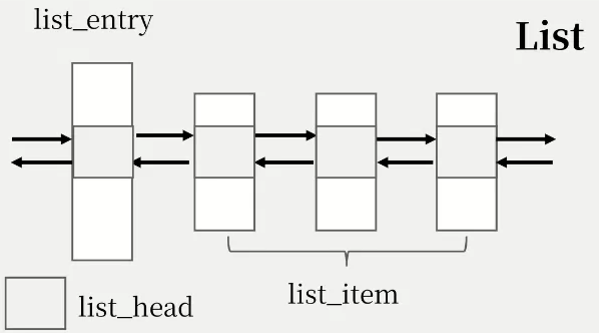
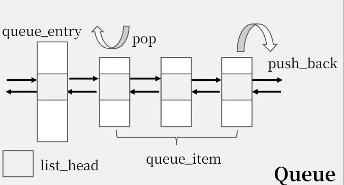
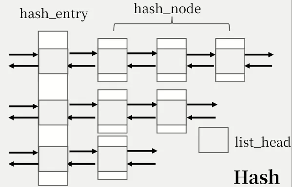
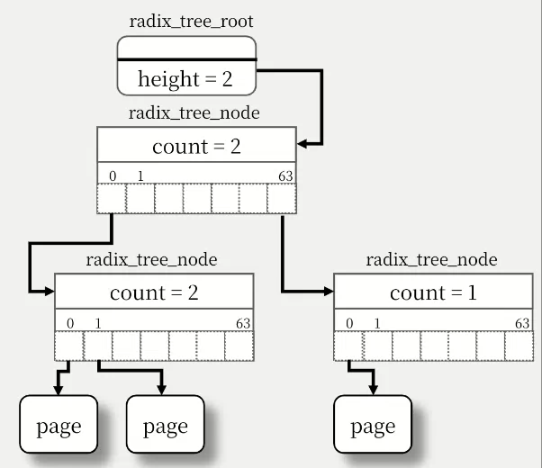

#### 内核数据结构使用手册

使用C语言完成“范型”内核数据结构是我们设计的主要目标！

1. **首先就是需要充分使用Linux自带list.h** 

内核中最重要的数据结构就是双向循环链表，否则只能是使用固定大小的全局数组。



下面是内核中的一些典型list使用场景：

- signal pending list
- timer  pending list
- thread group list
- bio submit list
- ...

主要使用的接口如下：

```c
static inline void INIT_LIST_HEAD(struct list_head *list);
static inline void list_add(struct list_head *pnew, 
                            struct list_head *head);
static inline void list_add_tail(struct list_head *pnew,
                                 struct list_head *head);
static inline void list_del_reinit(struct list_head *entry);
static inline int list_empty(const struct list_head *head);
list_for_each_entry(pos, head, member);
list_for_each_entry_safe(pos, n, head, member);
```


2. **然后是需要利用 list.h 构造一个通用的queue，就可以完成先进先出的结构。**



下面是内核中的一些典型的queue使用场景：

- process state queue
- thread state queue
- futex waiting queue
- cond waiting queue

使用的主要接口如下：

```c
int Queue_isempty(Queue_t *q);
void Queue_push_back(Queue_t *q, void *node);
void *Queue_pop(Queue_t *q, int remove);
```


3. **其次是由于使用的纯粹C代码编写的内核，没有现成的MAP，于是我们需要实现一个通用的hash表。**



下面是内核中一些典型的hash表使用场景：

- pid_map
- tid_map
- futex_map
- i_hash
- ipc_ids->key_ht

使用的主要接口如下：

```c
struct hash_node *hash_lookup(struct hash_table *table, void *key, struct hash_entry **entry, 
                              int release, int holding);
void hash_insert(struct hash_table *table, void *key, void *value, int holding);
void hash_delete(struct hash_table *table, void *key, int holding, int release);
void hash_destroy(struct hash_table *table, int free);
```


4. **然后是针对FAT32的目录遍历需要单独设置一个栈，用来实现对long entry 和 short entry的方便访问。**

栈的存储类型为long entry！


下面是主要使用接口：

```c
int stack_is_empty(Stack_t *);
void stack_push(Stack_t *, elemtype);
elemtype stack_pop(Stack_t *);
```


5. **最后是将实现Linux中页高速缓存需要radix-tree，来加速文件的read和write。**



主要功能就是根据一个文件的读写起始游标off转化为page 的index和offset，实现对数级别的查找、插入和删除。

主要接口为：

```c
int radix_tree_insert(struct radix_tree_root *root, uint64 index, void *item);
void *radix_tree_lookup_node(struct radix_tree_root *root, uint64 index);
void radix_tree_free_whole_tree(struct radix_tree_node *node, uint32 max_height, 
                                uint32 height);
```


