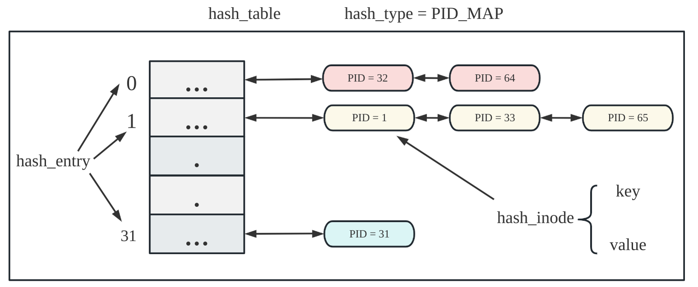

# 内核通用数据结构——hash表

##### 为什么内核中需要一个通用的hash表的结构？

顺序扫描一个链表或者一个数组，并检查数组元素或者链表结点的合法性是相当低效的。而hash表能够提供快速的查找和插入操作。通过使用哈希函数将每个键映射到一个固定的索引位置，哈希表在访问或更新元素时，直接根据索引来进行快速的查找和插入操作，时间复杂度为 O(1)，而不是O(n)。通过hash表，可以将任意的数据类型映射到一个地址，加速查找的效率。


##### 实现一个通用的hash表需要定义什么数据结构和接口？

通过定义一个枚举类型、使用union变量和Linux的list.h轮子可以快速高效实现一个通用的hash表。

```c
// hash表的类型
enum hash_type { PID_MAP,
                 TID_MAP,
                 FUTEX_MAP,
                 INODE_MAP
};

// hash表的结点
struct hash_node {
    union {
        int key_id;
        void *key_p;
        char key_name[NAME_LONG_MAX];
    };
    void *value;
    struct list_head list;
};

// hash表的入口
struct hash_entry {
    struct list_head list;
};

// hash表
struct hash_table {
    struct spinlock lock;
    enum hash_type type;
    uint64 size; // table size
    struct hash_entry* hash_head; // hash entry 
};
```

上面的hash_type定义了4中类型的hash表：

```c
// 通过pid快速得到proc的指针
1. pid->proc*
// 通过tid快速得到tcb的指针
2. tid->tcb*
// 通过uaddr快速得到futex的指针
3. uaddr->futex*
// 通过文件名快速得到这个文件的ino和off
4. name->inode_cache*
struct inode_cache {
    uint32 ino;
    uint32 off;
};
```

实现hash表的接口如下：

```c
// find the table entry given the table，type and key
struct hash_entry *hash_get_entry(struct hash_table *table, void *key);
// lookup the hash table
// release : release its lock?
struct hash_node *hash_lookup(struct hash_table *table, void *key, 
                              struct hash_entry **entry, int release);
// insert the hash node into the table
void hash_insert(struct hash_table *table, void *key, void *value);
// delete the inode given the key
void hash_delete(struct hash_table *table, void *key);
// destroy hash table
// free : free this table global ?
void hash_destroy(struct hash_table *table, int free);
// hash value given a string
uint64 hash_str(char *name);
// choose the key of hash node given type of hash table
uint64 hash_val(struct hash_node *node, enum hash_type type);
// judge the key of hash node given key and type of hash table
uint64 hash_bool(struct hash_node *node, void *key, enum hash_type type);
// assign the value of hash node given key and table type
void hash_assign(struct hash_node *node, void *key, enum hash_type type);
// init every hash table entry
void hash_table_entry_init(struct hash_table *table);
```

1. 一定要注意是否需要获取hash表的锁。
2. 别忘记kfree hash_node的value。
3. lookup 一定要用二级指针来传递entry指针给insert和delete接口。
4. hash_str的作用是给一个字符串进行编码。

```c
uint64 hash_str(char *name) {
    uint64 hash_val = 0;
    size_t len = strlen(name);
    for (size_t i = 0; i < len; i++) {
        hash_val = hash_val * 31 + (uint64)name[i];
    }
    return hash_val;
}
```

hash表的数据结构示意图如下：



对于给定的key，得到value的步骤如下：

```
// 1. 将key根据不同的hash表类型得到一个uint64的类型，然后对hash表的大小进行取余，得到entry。
// 2. 获取hash table的锁。
// 3. 遍历entry的链表，查找key对应的value。
// 4. 释放hash table的锁。
```


##### 哪些场景需要使用hash表？

1. kill syscall需要通过传入的pid获取对应的proc*。

```c
inline struct proc *find_get_pid(pid_t pid) {
    struct hash_node* node = hash_lookup(&pid_map, (void *)&pid, NULL, 1);
    // realese it 
    if(node!=NULL){
        return (struct proc *)(node->value);
    } else{
        return NULL;
    }
}
```

2. tkill syscall需要通过传入的tid获取对应的tcb*。

```c
inline struct tcb *find_get_tid(tid_t tid) {
    struct hash_node* node = hash_lookup(&tid_map, (void *)&tid, NULL, 1);
    // release it
    if(node!=NULL){
        return (struct tcb *)(node->value);
    } else{
        return NULL;
    }
}
```

3. fa32_inode_dirlookup可以根据hash表，通过名字快速得到对应的inode*

```c
ip_search = fat32_inode_hash_lookup(dp, name);
if(ip_search!=NULL) {
    return ip_search;
}
```

4. get_futex 可以根据hash表，通过uaddr快速得到对应的futex结构体指针 futex*

```c
struct futex *get_futex(uint64 uaddr, int assert) {
    struct hash_node *node;

    node = hash_lookup(&futex_map, (void *)uaddr, NULL, 1, 0); // release it, not holding lock
    if (node) {
        // find it
        return (struct futex *)(node->value);
    } else {
        if (assert == 1) {
            return NULL;
        }
        // create it
        struct futex *fp = (struct futex *)kzalloc(sizeof(struct futex));
        if (fp == NULL) {
            printf("mm : %d\n", get_free_mem());
        	panic("get_futex : no free space\n");
        }
        futex_init(fp, "futex");
        hash_insert(&futex_map, (void *)uaddr, (void *)fp, 0); // not holding lock
        return fp;
    }
}
```


##### 补充：

通过hash表加速dirlookup的接口：

```c
// 1. init the hash table of inode
void fat32_inode_hash_init(struct inode* dp);
// 2. insert inode hash table
int fat32_inode_hash_insert(struct inode* dp, const char* name, uint ino, uint off);
// 3. lookup the hash table of inode
struct inode* fat32_inode_hash_lookup(struct inode* dp, const char* name);
// 4. delete hash table of inode
void fat32_inode_hash_destroy(struct inode* dp);
```


