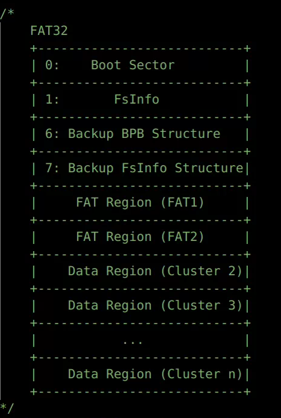
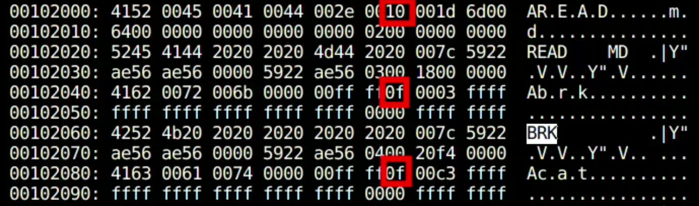

# FAT32文件系统从0编写

#### FAT32文件系统的扇区分布情况




这里是按照一个扇区一个扇区来进行计算，给定每个扇区大小是512B。0号扇区是Boot Sector，1号扇区是Fsinfo，6号扇区是0号扇区的一个备份，7号扇区是1号扇区的一个备份。然后是FAT表所在的区域。FAT1是主要使用的FAT所在的区域，FAT2是其对应的备份。在FAT2之后的地方就是簇号为2开始的数据区。


#### FAT32文件系统需要注意的一些点

1. 磁盘中没有单独给根目录准备一段区域，即根目录没有对应的文件控制块FCB。
2. 根目录中没有`.`和`..`，其他目录中有。
3. 一定要支持长目录项，否则无法正确获取文件名字大于11的文件。
4. 使用保留扇区的数量和FAT表的信息就可以算出数据区对应的地方。
5. FAT表的cluster0和cluster1是保留的，即实际上我们只能从cluster2开始读取。
6. FAT表的entry只有低28位有效，而高4位无效。
7. 无论是长目录项还是短目录项，都是32字节，如果第一个字节是0x00，那么代表后面的内容都是空闲的。如果第一个字节是0xE5，那么代表只能说明当前的目录项是空闲的。
8. 在磁盘中，FAT32只有DIRECTORY和非DIRECTORY两种文件，我们对于一个非目录文件，将其ATTR设置为了0x20。且对于文件的访问权限，只有READ_ONLY这一种情况。
9. 一个文件的数据块的起始簇号，需要通过将其高16位和低16位拼接的方式得到。
10. 长目录项对应的文件的名字的最大值为255，路径的最大长度为260。
11. 一个文件最多拥有20个长目录项，最后一个长目录项的Ord需要是以0x40开头。
12. 长目录项的名字字符是两个字节表示一个字符（原本应为一个字节表示一个字符），每个字符后面都跟一个空格（0x20）。
13. 为了兼容xv6代码（每个inode有一个唯一的ino），我们将根目录对应的inode对应的ino设置为了0，其他的inode的ino从1开始进行映射。在FAT32文件系统中的某个文件一定有一个短目录项，所以我们将这个短目录相对于cluster2的第一个32字节的偏移作为ino。
14. 由于FAT32的短目录项中没有专门设置设备号的字段，于是我们用DIR_NTRes这个保留字段。
15. 短目录项的DIR_FileSize对于目录文件是0，对于非目录文件就是其数据块含有内容的大小。
16. 长目录项记录的文件名的字符是正确的名字（大小写区分）。短目录项记录的文件名对应的字符全是大写，且用空格0x20填充。
17. 为了和原始的xv6进行兼容，我们保留了i_nlink。但实际上这个字段只有0和1两种取值，原因是FAT文件系统中没有hard link这个概念，只有软链接这个概念。


#### BPB（BIOS Parameter Block）和FSinfo扇区中一些重要的字段

下面是一个用Linux上的mkfs.vfat工具生成一个128MB大小，一个簇2个扇区的磁盘镜像中的部分参数：

- OEMNAME : mkfs.fat （OEM Name Identifier.）
- BytsPerSec : 512 （ Count of bytes per sector）
- SecPerClus : 2 （Number of sectors per allocation unit）
- RsvdSecCnt : 32 （Number of reserved sectors in the reserved region）
- NumFATs : 2 （The count of file allocation tables (FATs) on the volume）
- SecPerTrk : 32 （Sectors per track for interrupt 0x13）
- NumHeads : 8 （Number of heads for interrupt 0x13）
- TotSec32 : 262144 （The count of all sectors in all four regions of the volume）
- FATSz32 : 1016 （32-bit count of sectors occupied by ONE FAT）
- RootClus : 2 （Cluster number of the first cluster of the root directory）
- FSInfo : 1 （Sector number of FSINFO structure）
- BkBootSec : 6 （The sector number in the reserved area of the volume of a copy of the boot record）
- FilSysType : FAT32 （System identifier string  "FAT32 "）
- Free_Count : 126606 （The last known free cluster count on the volume）
- Nxt_Free : 3435 （The cluster number at which the driver should start looking for free clusters）


#### FAT32文件系统的基本接口

##### superblock

1. **读取bpb和fsinfo，并设置根目录的inode信息。**

```c
int fat32_fs_mount(int, struct _superblock *);
```

- 设置磁盘镜像锁在的设备号。
- 初始化superblock的互斥信号量。
- 读0号扇区和1号扇区的内容，并写入superblock中的字段中。
- （记得每次使用bread后brelse）
- 初始化根目录的内存中的inode结构体。

2. **读取并解析0号扇区的内容，将其写入superblock对应的字段。**

```c
int fat32_boot_sector_parser(struct _superblock *, fat_bpb_t *);
```

3. **读取并解析1号扇区的内容，将其写入superblock对应的字段。**

```c
int fat32_fsinfo_parser(struct _superblock *, fsinfo_t *);
```


##### inode

除了通过长目录项读取到的文件完整名字fname这个字段和短目录项中的基本字段外，内存中的inode还含有下面三个字段：

```c
uint32 cluster_end; // end num （最后一个簇对应的实际簇号）
uint64 cluster_cnt; // number of clusters （簇的数量）
uint32 parent_off;  // offset in parent clusters 
//（在parent inode中的偏移，将长目录项也考虑了进去的偏移）
```

我们通过cluster_cnt表示该文件占有的簇的数量，通过cluster_end表示该文件占有最后一个簇的簇号。

这一层的代码完全是从0编写，兼容Xv6的代码风格，将索引文件系统修改为FAT32这样的典型显示链表的磁盘数据块组织方式，实现了FAT32官方手册的绝大部分内容（95%以上，可能还有一些细节没有考虑）。

对于short entry的一些时间字段，我们并没有特别进行考虑，不是主要内容。

只要合理用好buffer cache的三个接口bread、bwrite和brelse即可完成FAT的字节、扇区和簇的数据读取和修改等一系列操作。

**下面介绍一些比较重要的inode层的接口：**

1. **初始化fat32文件系统的根目录inode**

```c
struct inode *fat32_root_inode_init(struct _superblock *sb);
```

- ino 为0
- valid 为1
- parent 为本身
- 文件名为 /
- 获取到最后一个簇号
- 设置目录的i_size
- 设置i_type
- 初始化hash表的映射
- 初始化off_hint

2. **给定num，返回inode数据块的第num个簇号**

```c
// num == 0 ~ return count of clusters, 
// set the inode->fat32_i.cluster_end at the same time
// num != 0 ~ return the num'th physical cluster num
uint32 fat32_fat_travel(struct inode *ip, uint num);
```

- 主要就是用fat32_next_cluster和ISEOF对inode的FAT表进行遍历。
- write、read、dirlookup都会用到这个接口（通过fat32_cursor_to_offset体现）。
- 通过这个接口可以快速得到某个文件数据块的逻辑簇的实际簇号。

3. **查询磁盘中的FAT表获取下一个簇号**

```c
uint fat32_next_cluster(uint cluster_cur);
```

- 通过ThisFATEntSecNum获取到FAT表的扇区号。
- 然后通过bread读取对应的扇区。
- 通过FAT32ClusEntryVal获取指定簇号的FAT表项。
- （一定要释放bp）

4. **分配一个空闲的簇**

```c
uint fat32_cluster_alloc(uint dev);
```

- 首先是获取superblock的互斥信号量，防止data race。
- 确保还有空闲的簇（可以通过superblock的free_count字段判断）。
- 读取这个簇的第一个扇区的第一个字节。
- 如果第一个字节表明后面全空，并且不是最后一个，那么就可以更新nxt_free这个hint。
- （一定要在fat32_fat_set之前brelse）
- 找到了对应的空闲簇的簇号，只需要通过fat32_fat_set设置对应的FAT表即可。
- 如果nxt_free这个hint无效，就只能通过fat32_fat_alloc从FAT表的开始进行查找一个可以使用的空闲簇。
- （记得更新nxt_free）
- （记得释放superblock的互斥信号量）
- 在分配完后，需要及时将fsinfo写回磁盘，即更新字段Free_Count和Nxt_Free。
- 为了确保分配的空闲簇没有脏数据，需要通过fat32_zero_cluster来清空磁盘内容，并写回磁盘。（可能没有必要）

5. **更新磁盘镜像中的fsinfo**

```c
void fat32_update_fsinfo(uint dev);
```

- 就是读取1号扇区和7号扇区的内容，将Free_Count和Nxt_Free更新，并写回。
- （在brelse之前一定要记得用bwrite写回）

6. **FAT表的头部开始查询可以使用的空闲簇**

```c
uint fat32_fat_alloc();
```

- （一定要使用FAT_CLUSTER_MAX这个宏作为循环的最大值，即通过当前磁盘的数据块数量算出当前磁盘中的簇数量）
- 无非就是从FAT_BASE这个扇区开始一个扇区一个扇区查找，然后每4个字节为单位查找是否有全0的FAT entry，如果有，将其设置为全F即可。
- （一定要记得用brelse释放block的互斥信号量！）

7. **设置指定簇号对应的FAT表的4字节表项。**

```c
void fat32_fat_set(uint cluster, uint value);
```

- 通过ThisFATEntSecNum找到簇对应的FAT的扇区号，然后通过SetFAT32ClusEntryVal设置FAT表的表项。（记得写回）

8. **move search cursor(<cluster, sector, offset>) given off**

移动<cluster, sector, offset>这个三元组游标。

```c
void fat32_cursor_to_offset(struct inode *ip, uint off, FAT_entry_t *c_start, int *init_s_n, int *init_s_offset);
```

- 如果想读取某个文件的某个特定offset位置的字节，首先就需要用这个去移动三个游标：
- 簇号、扇区号、扇区中的offset偏移。
- 主要就是用了fat32_fat_travel接口和LOGISTIC_C_NUM移动cluster游标。
- 然后通过LOGISTIC_S_NUM移动sector游标；通过LOGISTIC_S_OFFSET移动offset游标。
- （需要注意的是，如果offset一下子过大，超过了某个文件分配的簇，需要及时进行分配簇号）
- （我们支持了offset大于文件占用的大小，即offset指向的字节太大，需要几个新的簇，就会通过fat32_cluster_alloc分配几个新的簇）

9. **给定某个文件的inode、开始读字节的off和读取字节数组的长度，将字节拷贝到的dst。**

```c
ssize_t fat32_inode_read(struct inode *ip, int user_dst, uint64 dst, uint off, uint n);
```

- 首先就是确保off和n的合法性（读取文件的内容一定不能读取大于文件大小的内容）
- 然后通过fat32_cursor_to_offset移动移动<cluster, sector, offset>这个三元组游标。
- 最后通过ISEOF、bread、either_copyout和fat32_next_cluster即可完成字节的读取。
- （注意init_s_offset的赋值的含义）
- 懂了下面这个语句的含义，就懂了扇区字节数据读取的精髓：

```c
m = MIN(BSIZE - init_s_offset, n - tot);
```

- （记得在返回时一定要brelse）
- （注意tot达到循环条件时一定要及时break）
- 使用fat32_next_cluster更新iter_c_n，实现对簇的遍历。

10. **给定某个文件的inode、开始写字节的off和写字节数组的长度，将字节写入到磁盘中。**

```c
ssize_t fat32_inode_write(struct inode *ip, int user_src, uint64 src, 
                          uint off, uint n);
```

- （大致和read思路一样，都是先移动游标，通过和 either_copyin实现数据的拷贝。

```c
m = MIN(BSIZE - init_s_offset, n - tot);
```

- （不要忘记加上bwrite(bp)
- FirstSectorofCluster就是用来获取指定簇的第一个扇区，然后通过遍历每个簇的扇区即可。
- 和read最大的不同就是需要判断是否需要分配新的簇，记得及时更新iter_c_n和FAT表的表项。

```c
next = fat32_next_cluster(iter_c_n);
if (ISEOF(next)) {
    FAT_entry_t fat_new = fat32_cluster_alloc(ROOTDEV);
    fat32_fat_set(iter_c_n, fat_new);
    iter_c_n = fat_new;
    ip->fat32_i.cluster_cnt++;
    ip->fat32_i.cluster_end = fat_new;
} else {
    iter_c_n = next;
}
```

- 然后就是需要及时更新内存中的inode的i_size字段，并通过fat32_inode_update更新磁盘信息。

```c
if (off + n > fileSize) {
    if (S_ISREG(ip->i_type))
        ip->i_size = off + tot;
    else
        ip->i_size = CEIL_DIVIDE(off + tot, 
                                 ip->i_sb->cluster_size) * (ip->i_sb->cluster_size);
}
fat32_inode_update(ip);
```

- 需要注意的是，数据文件的i_size不一定是簇的整数倍，而目录文件的i_size是簇的整数倍（即分配了多少簇，文件大小就是分配多少簇对应的字节数量。

11. **就是使用完全一样的inode，将ref，引用数量++即可（一定要记得获取inode_table的锁）**

```c
struct inode *fat32_inode_dup(struct inode *ip);
```

12. **在全局可用的inode表中选出一个可以使用的inode**

```c
struct inode *fat32_inode_get(uint dev, uint inum, const char *name, uint parentoff);
```

- 根据dev、ino进行查表，只要发现了完全匹配的就可以返回这个inode。
- 如果发现ref已经大于0了，只需要将ref++即可。
- 然后就是初始化inode的一些字段。记得释放表的锁。

13. **拷贝文件的long entry 和 short entry的FCB组合**

```c
int fat32_fcb_copy(struct inode *dp, const char *name, struct inode *ip);
```

14. **获取inode的互斥信号量，并尝试加载short entry的字段到内存**

```c
void fat32_inode_lock(struct inode *ip);
```

15. **加载磁盘中short entry的重要字段到内簇中的inode**

```c
int fat32_inode_load_from_disk(struct inode *ip);
```

- 使用FATINUM_TO_SECTOR和FATINUM_TO_OFFSET即可完成short entry的定位。
- 比较重要的字段：
- Attr、DIR_FstClusHI、DIR_FstClusLO、DIR_Dev。
- 值的一提的是short entry 中的第13个字节原本是保留字段，但是我们使用这个字段保存设备文件的设备号。
- 记得设置valid = 1

16. **释放inode 的互斥信号量。**

```c
void fat32_inode_unlock(struct inode *ip);
```

17. **释放inode的资源**

```c
void fat32_inode_put(struct inode *ip);
```

- 本质就是ref自减。
- 如果这是最后一个ref就需要删除自己的hash表映射（如果hash表进行了初始化）
- 如果i_nlink为0，即这个inode被删除了，那么就需要及时删除inode parent 的 hash 表中的key和value。
- （注意，这里一定要获取inode parent 的互斥信号量，使hash_delete和fat32_inode_trunc组合是原子的）

18. **unlock 和 put 的组合接口**

```c
void fat32_inode_unlock_put(struct inode *ip);
```

19. **将inode从磁盘中删除且释放数据块**

```c
void fat32_inode_trunc(struct inode *ip);
```

- 利用ISEOF、fat32_next_cluster和fat32_fat_set对FAT表进行遍历并清0。
- 使用fat32_fcb_delete删除inode的long entry + short entry 的FCB组合。
- 给inode 中的字段进行清零赋值。

20. **更新inode，将inode的内容写回磁盘**

```c
void fat32_inode_update(struct inode *ip);
```

- 由于每个inode有一个i_no，可以十分轻松地找到每个inode的short entry在磁盘中的位置。
- 通过FATINUM_TO_SECTOR和FATINUM_TO_OFFSET即可找到inode 的short entry。
- （一定要注意FAT32的根目录没有FCB，即没有long entry + short entry 的组合，所以根目录的inode永远都不更新）
- 更新一些重要的字段：
- DIR_Attr、DIR_FstClusHI、DIR_FstClusLO、DIR_FileSize和DIR_Dev。
- （只要涉及到磁盘的写操作，都别忘记bwrite）

21. **给定一个long entry得到long entry存储的文件名**

```c
int fat32_filter_longname(dirent_l_t *dirent_l_tmp, char *ret_name);
```

使用LONG_NAME_CHAR_MASK和LONG_NAME_CHAR_VALID即可完成这个操作。

需要注意一点：long entry 的LDIR_Name1、LDIR_Name2和LDIR_Name3一个字符用2个字节表示。

22. **将long entry 从栈中弹出，用校验和检测合法性，并逐个拼接得到完整的文件名。**

```c
ushort fat32_longname_popstack(Stack_t *fcb_stack, uchar *fcb_s_name, char *name_buf);
```

- 这里主要是用到了fat32_stack的接口：
- stack_is_empty、stack_pop。
- 还有fat32_filter_longname用来得到long entry 所保存的文件名字。
- （注意对长目录项合法性的检验，即如果long entry 不合法，我们就只能使用short entry的DIR_Name表示文件名字了）

23. **校验和**

```c
uchar ChkSum(uchar *pFcbName);
```

- 用手册中给的代码即可。
- 注意输入是short entry 的DIR_Name字段。

24. **给定一个父目录，获取目录下name的inode**

```c
struct inode *fat32_inode_dirlookup(struct inode *dp, const char *name, uint *poff);
```

- 这个dirlookup作用只有一个，找到name对应的ino和off。
- 如果我们用hash表构建了这个映射，每次只需要查表即可O（1）复杂度找到。
- 用off_hint来维护已经查找过的offset，下次查找只需要从这个地方开始即可，可以最大程度减少hash表key 和 value的添加和删除操作。
- 首先查询hash表，如果没有再根据off_hint开始查找，如果还没有，那么就真的没有了，直接返回0。
- （精髓在于用hash表维护off_hint的左侧FCB的映射，用off_hint维护off_hint右侧FCB的映射）

25. **dirlookup的本体**

```c
struct inode *fat32_inode_dirlookup_with_hint(struct inode *dp, 
                                              const char *name, uint *poff);
```

- 通过 fat32_cursor_to_offset 移动<cluster, sector, offset>游标。
- 首先通过ISEOF、FirstSectorofCluster和fat32_next_cluster依次遍历文件的簇。
- 通过init_s_n、sectors_per_block依次遍历簇的每个扇区。
- 每32个字节为一个单位进行遍历，如果是long entry 就压栈，如果是short entry 就弹栈，然后检测short entry 和 long entry 是否为合法的组合。
- （使用NAME0_FREE_ALL加速查找的结束）
- （使用LONG_NAME_BOOL判断是long entry 还是 short entry）
- （使用NAME0_FREE_BOOL判断当前32字节是否有效）
- （如果long entry不合法，只能用short entry的DIR_Name代替）
- （使用SECTOR_TO_FATINUM完成每个short entry 的ino稀疏映射）
- （使用fat32_inode_hash_insert完成非'.'和'..'的name 到<ino , off> 的直接映射）
- 如果找到了，就可以用fat32_inode_get得到name对应的inode。
- （理解了init_idx和init_s_n的赋值，就理解了dirlookp_with_hint的精髓）
- 不要忘记释放fcb_stack的空间！
- （在返回前及时brelse）
- （如果没有找到对应的文件，就说明该目录下没有这个文件，需要将off_hint及时设置为0）

26. **创建一个新的inode**

```c
struct inode *fat32_inode_create(struct inode *dp, const char *name, 
                                 uchar type, short major, short minor);
```

- 用dirlookup查找是否存在这个name，同文件类型的文件。如果已经有了，就直接返回即可。
- 如果不存在，那么就需要用fat32_inode_alloc分配一个新的inode。
- 如果是目录文件（非根目录），需要向其数据块中写入 `.`和`..`的short entry。

27. **分配一个新的inode**

```c
struct inode *fat32_inode_alloc(struct inode *dp, const char *name, uchar type);
```

- 用fat32_fcb_init得到一个long entry + short entry 的FCB字节数组。
- 用fat32_dir_fcb_insert_offset找到需要插入的位置。
- 用fat32_inode_write写入即可。

28. **通过传入的文件名，构建long entry + short entry的FCB字节数组**

```c
int fat32_fcb_init(struct inode *ip_parent, const uchar *long_name, 
                   uchar type, char *fcb_char);
```

- 全是细节需要考虑，无非就是long entry + short enty 的各个字段需要一个一个赋值。

29. **找到short entry相同前缀的文件数量。**

```c
uint fat32_find_same_name_cnt(struct inode *ip, char *name);
```

- 循环还是三层：
- FAT seek cluster chains、sectors in a cluster和FCB in a sector。
- 注意匹配条件：

```c
if (!strncmp((char *)fcb_s[idx].DIR_Name, name, 6) && fcb_s[idx].DIR_Name[6] == '~') {
    ret++;
}
```

30. **找到一个FCB可以插入的地方**

```c
uint fat32_dir_fcb_insert_offset(struct inode *ip, uchar fcb_cnt_req);
```

- 只要找到一个非空闲的32字节，就需要重新计数。
- 只要找到了一个空闲的32字节，就依次自增，直到达到需要的连续32字节空闲的数量，就可以返回了。

- （这样做，就可以每次插入到碎片中）

31. **删除inode的long entry + short entry的FCB组合**

```c
int fat32_fcb_delete(struct inode *dp, struct inode *ip);
```

- 根据文件的名字长度和parent_off找到插入的位置，然后构建一个FCB的字节数组，通过fat32_inode_write写入即可。

32. **清空整个簇**

```c
void fat32_zero_cluster(uint64 c_num);
```

33. **解析short entry 的文件名**

```c
void fat32_short_name_parser(dirent_s_t dirent_s, char *name_buf);
```

- 当long entry出现问题，只能使用short entry的DIR_Name构建一个文件名。

34. **inode dirlookup的hash表映射初始化**

```c
void fat32_inode_hash_init(struct inode* dp);
```

35. **inode dirlookup的hash表映射插入key 和 value**

```c
int fat32_inode_hash_insert(struct inode* dp, const char* name, uint ino, uint off);
```

36. **inode dirlookup的hash表查找key对应的value**

```c
struct inode* fat32_inode_hash_lookup(struct inode* dp, const char* name);
```

37. **摧毁inode dirlookup 的 hash表**

```c
void fat32_inode_hash_destroy(struct inode* ip);
```


##### 遇到的问题：

1. 如下图，在启动系统并加载init程序后，会发现磁盘中的数据区的第一个长目录项的Attr被修改。起初我们怀疑工具生成错误，但实际上并不是，mkfs.vfat在生成后的磁盘镜像是正确的，但是在生成console.dev文件后发现第一个长目录项被改了，后来发现就是在兼容xv6代码时忘记了根目录没有FCB，当修改根目录下的内容时，不需要更新根目录的FCB（主要就是我们人为将根目录的ino设置为了0，如果更新根目录的FCB，那么第一个32字节的内容必定会被修改，但这种修改是不合理的）



所以我们在fat32_inode_update中添加了下面的特判就解决了问题：

```c
// root has no fcb, so we don't update it!!!
if (ip->i_ino == 0) {
    brelse(bp);
    return;
}
```


2. 由于我们在重写xv6的dirlookup 的时候使用了一个fcb_stack的栈的结构，而且这个栈是一个固定大小的数组，大概会占960个字节，但我们的内核栈只有4096个字节，所以很容易爆栈，然后就会发生某个变量的值奇怪地被修改的问题。于是我们用kalloc申请fcb_stack的内存空间，从而避免了在栈上申请空间爆栈的问题。

```c
void stack_init(Stack_t *stack) {
    stack->data = (elemtype *)kmalloc(30 * 32);
    if (stack->data == NULL) {
        panic("stack_init : there is no free space\n");
    }
    stack->top = -1;
}
```


