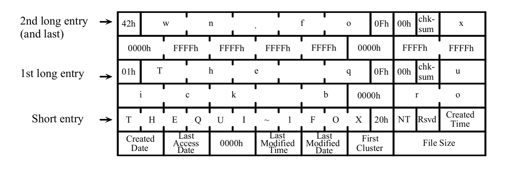
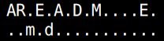
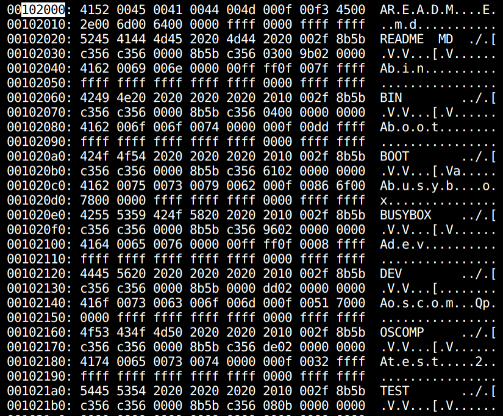

# FAT32 long entry倒序处理

##### 为什么FAT32文件系统需要一个栈的结构？

如下图：




磁盘中的一个文件一定有一个short entry，而long entry主要用来存放文件的名称。而long entry相对于short entry是倒序放的，所以用栈来存放long entry是十分自然的想法，即先正序压入栈中，然后倒序弹出，拼接long entry的的LDIR_Name1、LDIR_Name2、LDIR_Name3三个字段就可以得到文件的完整名字。需要注意的是，用long entry得到的文件名字是区分大小写的，且一个long entry可以存放13个字符。

且注意到磁盘中long entry 和 short entry都是32个字节，且last long entry 的第一个字节（即LDIR_Ord字段）的高4个bit一定是0x4，所以可以通过这个来判断是否可以开始进行压栈操作。在遍历磁盘的扇区的过程中，对于每个32字节的结构体，可以通过第12个字节来判断是否为long entry（如果这个字节是0x0F就是long entry，如果是0x20，就是short entry）。

需要注意的是每个long entry的checksum字段是用来检测这个long entry 是否为紧挨着的short entry匹配的目录项，即chkSum函数传入的参数是short entry的DIR_Name字段。

```c
uchar ChkSum(uchar *pFcbName) {
    uchar Sum = 0;
    for (short FcbNameLen = 11; FcbNameLen != 0; FcbNameLen--) {
        Sum = ((Sum & 1) ? 0x80 : 0) + (Sum >> 1) + *pFcbName++;
    }
    return Sum;
}
```


##### 实现这个long entry的栈，要定义什么数据结构和哪些接口？

```c
typedef dirent_l_t elemtype;
struct Stack {
    int top;
    elemtype *data;
};
typedef struct Stack Stack_t;
// 1. 初始化栈
void stack_init(Stack_t *);
// 2. 判断栈是否为空
int stack_is_empty(Stack_t *);
// 3. 判断栈是否已满
int stack_is_full(Stack_t *);
// 4. 入栈操作
void stack_push(Stack_t *, elemtype);
// 5. 出栈操作
elemtype stack_pop(Stack_t *);
// 6. 获取栈顶元素
elemtype stack_peek(Stack_t *);
// 7. 释放栈分配的空间
void stack_free(Stack_t *);
```

需要注意的是，这里的data，一定要通过kalloc来分配，否则这样一个数组很容易出现爆栈的问题。且这里仅仅需要对long entry进行压入栈和弹出栈的操作，所以elemtype是long entry的结构体类型。

```c
void stack_init(Stack_t *stack) {
    stack->data = (elemtype *)kmalloc(30 * 32);
    if (stack->data == NULL) {
        panic("stack_init : there is no free space\n");
    }
    stack->top = -1;
}
```

一定要记住释放栈的空间（防止内存泄漏）。

```c
// 释放栈的空间
void stack_free(Stack_t *stack) {
    kfree(stack->data);
}
```


##### 怎么使用这个栈的结构来辅助dirlookup？

```c
// 定义并初始化
Stack_t fcb_stack;
stack_init(&fcb_stack);
// 压入栈中
while (LONG_NAME_BOOL(fcb_l[idx].LDIR_Attr) && idx < FCB_PER_BLOCK) {
    stack_push(&fcb_stack, fcb_l[idx++]);
    off++;
}
// 弹出栈获取完整的文件名
ushort long_valid = fat32_longname_popstack(&fcb_stack, 
                                            fcb_s[idx].DIR_Name, name_buf);
// 释放栈的空间
stack_free(&fcb_stack);
```

两个接口中使用了这个数据结构（一个是生成，一个是解析）：

```c
// 初根据attr，文件的完整名字，得到一个long entry + short entry的字节数组（FCB）
int fat32_fcb_init(struct inode *ip_parent, const uchar *long_name, 
                   uchar attr, char *fcb_char);

// 找到某个目录下文件名为name的inode
struct inode *fat32_inode_dirlookup_with_hint(struct inode *dp, 
                                    const char *name, uint *poff);
```


##### 关于FAT32的long entry 和 short entry必须要强调的地方！

1. FAT32限制文件的名字长度不超过255个字节，即小于20个long entry。
2. long entry的一个字符用两个字节表示，一个字符+一个全0字节的形式表示。且LDIR_Name1、LDIR_Name2、LDIR_Name3这三个字段都是以`\0`结尾。其余的字节通过0xFF填充。




3. long entry 的LDIR_Ord字段
4. short entry，前8字节为文件名，后3字节为拓展名，共11个字节。由于点“.”的位置是固定的，因此不需要实际进行存储（类似浮点数的存储）。short entry不支持小写字母，所有文件名中的小写字母会被自动转换成大写字母进行存储。

4. 如果文件名超过8字节，则会被截断并添加序号以做区别。如mydatafile.dat会被变为MYDATA ~ 1DAT，其中MYDATA为原文件名的前6个字符，~1表示此文件名是被截断的，而且其是此类文件名中的第一个。如果MYDATA ~ 1.DAT文件已经存在，则mydatafile.dat会被变为MYDATA~2.DAT，以此类推。

5. short entry的用0x20填充DIR_Name这个字段。


##### 补充：

在linux下，通过下面命令可以查看磁盘镜像的内容：

```
// 假设镜像的名称是 fat32.img
xxd fat32.img | less
```

如果知道字节的地址，就可以直接搜索找到。



