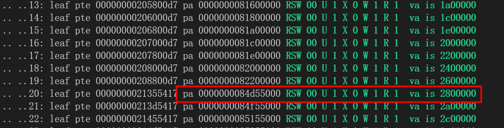
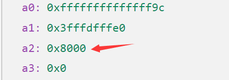

## **misaligned** pagefault

- 在支持superpage的过程中，进程触发了一个pagefault，导致该进程被杀死：

  该进程的页表打印出来如下：

  

  该进程被kill时，对应的scause和stval如下图：

  

  可见该进程是在访问0x2800000这个地址时触发了一个STORE PAGEFAULT

- 问题排查：

  首先从页表中可见的是，2800000这个地址位于该进程的页表中，且拥有PTE_W权限，此外，我们排除了常见的pagefault原因，诸如访问空指针等错误

  在经过了长时间的debug后，我们发现这个pagefault的原因是地址没有对齐导致的

  根据riscv-privileged手册中的描述：

  ```
  If i > 0 and pte.ppn[i − 1 : 0] ̸= 0， this is a misaligned superpage; stop and raise a page-fault
  exception corresponding to the original access type.
  ```

- 原因:伙伴系统实现中，多核的伙伴系统采用page_to_offset的机制而非page_to_pa

  即每个伙伴系统看做一个相对的地址空间，该地址空间的范围是：从0到这个伙伴系统的内存的ending

  而这个相对空间的起始地址对应的绝对物理地址可能没有按照大页的方式对齐，导致这里出现地址不对齐的page fault

- 解决方式：

  通过调整内存布局的宏的大小，让每个CPU拥有的物理地址空间的起始地址都是2M对齐的


## 合并过程中保留了两份不同的结构体定义

在对不同分支的代码进行合并时，由于我的疏忽，在两个不同的头文件中保留了一个结构体的两份不同的定义

``` c++
struct proc {

}; // in header_file_1
struct proc {

}; // in header_file_2

/* src1 */
#include"header_file_1"
/* use struct proc */

/* src2 */
#include"header_file_2"
/* use struct proc */
```

具体的情形如上，在两个不同的头文件中都保留了proc这个结构体的定义，但是这两个结构体中的字段位置甚至数量都有所不同，且在两个不同的源文件中，分别引用了这两个头文件，这导致两处不同的代码使用不同的偏移访问proc中的同一个字段，导致panic的发生

即便是开了`-Wall -Werror`， 编译器也对这类"错误"熟视无睹!

## FAT32文件系统
FAT32文件系统的 fcb 用以记录的关于文件类型的字段只有 **DIR_Attr**，用以标识是否为目录。  
在初始化镜像时，Linux 系统下的 cp 工具能够正确地往该字段写入值。  
然而，我们重命名了 fcb 中的保留字段 **DIR_Dev** 用以保存更多的文件类型信息，以及主副设备号。这  
与官方的行为不一致，因此需要我们更多留心。  
此外，大多 FAT32 的 API 在涉及文件类型的变量时，使用的多为 uchar 类型，然而与 Linux 兼容  
的 inode 的节点中的 i_mode 字段是 uint16 类型。因此我们规定，如果 API 中的类型变量是  
uchar 类型，那么按照标准的 FAT32 来处理，若为 uint16， 则需要做更多的转换或特判。  
然而危险的是，如果错误地将 uint16 类型的变量传给了接收 uchar 类型的函数，编译器不会报错，  
即便我们打开了 `-Wall -Werror`！  
涉及到的 API 有 fat32_fcb_init， fat32_inode_alloc 等  
此外，FAT32 的 fcb 也不支持记录文件的使用权限。因此如果涉及到处理文件权限的情况，  
如下处理：
- 用户传入的 mode 参数，只取类型，忽略权限信息；  
- 传给用户的权限信息，全赋值为 0777

### 设备相关
在 fat32_inode_load_from_disk 函数中，有如下代码段：
```c
/* 有 bug 的代码 */ 
ip->i_rdev = FATDEV_TO_IRDEV(dirent_s_tmp->DIR_Dev);
mode = FATDEV_TO_ITYPE(dirent_s_tmp->DIR_Dev);  
if (ip->i_rdev) {       // 尝试用设备号字段判断类型，bug !
    // a device file
    ip->i_size = 0;
    ip->i_mode = mode;
} else if (DIR_BOOL(ip->fat32_i.Attr)) {
    // a directory
    ip->i_mode = S_IFDIR;
    ip->i_size = DIRLENGTH(ip);
} else {            // 暂不支持 FIFO 和 SOCKET 文件
    ip->i_mode = S_IFREG;
    ip->i_size = ip->fat32_i.DIR_FileSize;
}
...
```
上面这段代码的目的是解析磁盘中读取 fcb 中的 DIR_Dev 字段，转换为 inode 文件的 mode 字段和  
i_rdev 字段，前者记录文件类型，后者记录设备文件的主副设备号。在条件判断中，使用了 ip->i_rdev  
作为条件，如果不为0，则该文件是设备文件。  
这样看似正确，然而在我们的系统中，当使用 mknod 系统调用创立一个新的设备文件（如 CONSOLE，TTY，etc）  
时，系统无法将设备文件类型同设备号一起写入磁盘，而是先创建设备文件的 fcb，然后加载到内存的 inode 中， 
在内存中为 inode 赋予主副设备号，再调用 iupdate 函数将设备号的信息更新到磁盘中。  
所以，如果按上面代码的判断条件，在处理第一次创建的设备文件时，执行到判断条件时，ip 并不具有设备号  
的信息，这会导致进入错误的判断分支，甚至会导致系统无法运行 init 进程。  
因此正确的做法应当为
```c
ip->i_rdev = FATDEV_TO_IRDEV(dirent_s_tmp->DIR_Dev);
mode = FATDEV_TO_ITYPE(dirent_s_tmp->DIR_Dev);  
if (S_ISCHR(mode) || S_ISBLK(mode) ) {   // 用类型判断，而非用设备号！
    // a device file
    ip->i_size = 0;
    ip->i_mode = mode;
} else if (DIR_BOOL(ip->fat32_i.Attr)) {
    // a directory
    ip->i_mode = S_IFDIR;
    ip->i_size = DIRLENGTH(ip);
} else {            // 暂不支持 FIFO 和 SOCKET 文件
    ip->i_mode = S_IFREG;
    ip->i_size = ip->fat32_i.DIR_FileSize;
}
...
```

## SD卡驱动
利用 SPI 模式编写驱动最最重要的一个函数便是 __spi_xfer()， 它保证了读写的同步。先前遇到的诸多bug， 大多是因为之前编写的 spi_read() 与 spi_write() 底层没有很好地做到 SPI 模式数据传输的同步。

## PLIC
[qemu](https://www.qemu.org/docs/master/system/riscv/sifive_u.html)模拟的是[hifive u540](https://sifive.cdn.prismic.io/sifive/d3ed5cd0-6e74-46b2-a12d-72b06706513e_fu540-c000-manual-v1p4.pdf)， 比赛选的板子是[hifive u740](https://sifive.cdn.prismic.io/sifive/1a82e600-1f93-4f41-b2d8-86ed8b16acba_fu740-c000-manual-v1p6.pdf)， 两者在 PLIC 上有些差距，例如 u740 支持更多的外部中断源。此外，，qemu 只模拟了4个核。


## 系统调用
### openat
在测试 busybox 的 cat 程序时，我们发现其调用的 openat 系统调用总会返回不正确的值，经过  
调试后发现时读取到的 `flags` 值有误。而其他参数均正确。  
我们观察了几个寄存器的值，由于该系统调用是传递 4 个参数，所以对应于 a0~a3寄存器，结果确实  
flags 对应的 a2 寄存器值不正确，而其他寄存器的值均正确。 

0x8000 目前没有 flags 定义。

我们从用户库代码中查找，找到 cat 程序为 openat 系统调用传递的原始参数如下  
```c
int FAST_FUNC open_or_warn_stdin(const char *filename)
{
	int fd = STDIN_FILENO;

	if (filename != bb_msg_standard_input
	 && NOT_LONE_DASH(filename)
	) {
		fd = open_or_warn(filename， O_RDONLY);  // <== here
		// fd = open_or_warn(filename， 0x5656);		// test
	}

	return fd;
}

int FAST_FUNC open3_or_warn(const char *pathname， int flags， int mode)
{
	int ret;
// bb_perror_msg("open3_or_warn: flags = %d\n"，flags);
	ret = open(pathname， flags， mode);
	if (ret < 0) {
		bb_perror_msg("can't open '%s'"， pathname);
	}
	return ret;
}
```
也就是 flags 应当为 O_RDONLY，这个值为 0。说明在目前用户传递的参数是正确的，  
但在内核中读取到的值却变为了 0x8000.  
我们再一层层地寻找 open 的实现，最后发现它会调用如下代码。

``` c
// syscall.h
#define __sys_open_cp3(x，pn，fl，mo) __syscall_cp4(SYS_openat， AT_FDCWD， pn， (fl)|O_LARGEFILE， mo)
```
这里对第三个参数进行了或运算，而 O_LARGEFILE 的某个定义恰好为 0100000，即 0x8000，  
这就解释了为什么用户传入的 0 在内核中读到了 0x8000。  
于是我们可以对 openat 系统调用的参数读取时加入特殊处理，从而问题得以解决。

### ppoll
该系统调用返回正数才代表正确。最初实现为return 0， 这个错误导致无法正常执行shell脚本。

### dup3
在调用 generic_fileclose 前使用了自旋锁 tlock 对进程的 ofile 字段进行保护，但该函数可能会调用 iput，  
从而进行磁盘的写回，会涉及磁盘I/O，进而产生 sched lock 的 panic。现在将 tlock 改为信号量，从而解决了这个问题。

## iozone debug记录

调试用户程序技巧：

在iozone的Makefile中修改如下：

```c
CFLAGS	?= -g
```

去除所有编译优化的选项，修改 -O 、-O2、-O3修改为-g。记得进入`apps/iozone` 执行 `make clean`。

通过 break 设置断点。


读写文件的名称为 **iozone.tmp**

**（1）write_perf_test 测试**

Write and re-write

每次写入1024个字节，写两遍！

如果传入参数 为 4m，那么就是先从0开始写入4MB，然后再次从0开始写入4MB

**（2）read_perf_test 测试**

Read and re-fread test

每次读取1024个字节，读两遍！

如果传入参数 为 4m，那么就是先从0开始读取4MB，然后再次从0开始读取4MB

**（3）random_perf_test 测试**

Random read and write test

每次将f_pos 随机移动，然后读取1024个字节。

每次将f_pos 随机移动，然后写入1024个字节。

**（4）reverse_perf_test 测试**

Reverse read test

通过lseek移动f_pos从文件的末端读取，每次读取1024个字节。

注意这里的lseek 传入的offset 是一个负数，每次都需要减去-2048

do_lseek 中需要进行修改：

```c
MAX(0， f->f_pos)
```

返回值是新的文件偏移量，不能为负数

**（5）rewriterec_perf_test 测试**

Re-write the same record

反复写一个地方，即每次写完1024个字节后，用lseek将pos移动到写入前的状态

**（6）read_stride_perf_test 测试**

Read with a constant stride test

每次读取1024字节，只不过不是顺序读取，而是以 17KB 为一个stride进行移动

即f_pos : 0 -> 17408 -> 34816 -> ...

需要注意的是每次写入的前8个字节都是 

70 70 70 70 70 70 70 70

即每次写入的1024个字节的前8个字节都是 0x70 70 70 70 70 70 70 70


**（7）fwrite_perf_test**

fWrite and fre-write test

使用writev 进行写操作，每次1024个字节

**（8）fread_perf_test 测试**

fRead and fre-read test

使用readv 进行读操作，每次1024个字节

**问题一：**

在iozone目录下直接 iozone 会查找环境变量，需要在init中的环境变量中加入iozone

```c
char *envp[] = 
	{"PATH=/oscomp:/bin:/test:/busybox:/iozone"， 0};
```


**问题二：**

```c
iozone -a -r 1k -s 4m 
```

运行这个语句出现了

```c
lseek : Operation not permitted 
```

Strace 的lseek的返回值也是-1，显然是不正确的。需要将  arglong(1， &offset) 判断返回值小于0去掉，offset可以为负数。

openat iozone.tmp 的epc为：5a2d8 （去掉所有编译选项后的地址）


**问题三：**

read_stride_perf_test 测试过不了：出现的bug主要是do_generic_file_write存在一定的问题，修改如下：

```c
if(WRITE_FULL_PAGE(retval)||OUT_FILE(offset， isize_offset)){
    // need read page in disk
    read_from_disk = 0;
} else {
    // panic("not tested\n");
    read_from_disk = 1;
}
```

write/read
iozone -t 4 -i 0 -i 1 -r 1k -s 1m
顺序写+顺序读

random-read
iozone -t 4 -i 0 -i 2 -r 1k -s 1m
顺序写+随机读

read-backwards
iozone -t 4 -i 0 -i 3 -r 1k -s 1m
顺序写+反向读

stride-read
iozone -t 4 -i 0 -i 5 -r 1k -s 1m
顺序写+跳跃读


（1）multi_throughput_test

**问题一：**

```c
[PAGEFAULT]: va is not in the vmas
usertrap(): process name: iozone pid: 3
scause 000000000000000f STORE/AMO PAGEFAULT
sepc=0000000000058922
stval=0000000000000008
```

原因是：

sys_shmget、sys_shmat 和 sys_mctl 没有实现

shmget 的用户地址： 0x5086a.

**第一步：**

```c
shmid=(int)shmget((key_t)(IPC_PRIVATE)， (size_t)size1 ， (int)(IPC_CREAT|0666));
```

可以看出是创建一个private 的ipc，size1 为 0x2000， 两个页的大小。

**第二步：**

```c
addr = (char *)shmat((int)shmid， 0， 0);
```

addr 和 flag 都是0。

**第三步：**

```c
shmctl(shmid， IPC_RMID， 0);
```

删除共享存储段。

**问题二：**

测试调用了pselect6 ，所以需要先写好pselect6

用户态地址： 0x5a2d8

```c
while(child_stat->flag!=CHILD_STATE_BEGIN)   /* Wait for signal from parent */
    Poll((long long)1);

#ifdef HAVE_ANSIC_C
void Poll(long long time1)
#else
void Poll(time1)
long  long time1;
#endif
{
	struct timeval howlong;
	howlong.tv_sec=(int)(time1/100000);
	howlong.tv_usec=(int)(time1%100000); /* Get into u.s. */
	select(0， 0， 0， 0， &howlong);
}
```

**问题三：**

父子进程之间共用一个共享内存？？

clone的用户态地址：0x56070

```c
for(xyz=0;xyz<num_child;xyz++){ /* all children to state 0 (HOLD) */
    child_stat = (struct child_stats *)&shmaddr[xyz];
    child_stat->flag=CHILD_STATE_HOLD;
    child_stat->actual=0;
    child_stat->throughput=0;
    child_stat->cputime=0;
    child_stat->walltime=0;
}
```

**问题四：**

子进程无法停止？？

子：

```c
while(child_stat->flag!=CHILD_STATE_BEGIN)   /* Wait for signal from parent */
    Poll((long long)1);
```

父：

```c
while(child_stat->flag==CHILD_STATE_HOLD)
Poll((long long)1);
```

父进程一直没有给子进程发送信号？？？

父进程clone的用户地址：0x5b61c

```c
#ifdef HAVE_ANSIC_C
long long
start_child_proc(int testnum，long long numrecs64， long long reclen)
#else
long long
start_child_proc(testnum， numrecs64， reclen)
int testnum;
long long numrecs64， reclen;
#endif
{
	long long x;
	if(distributed && master_iozone)
	{
		x=(long long)pick_client(testnum，numrecs64， reclen);
	}
	else
	{
		x=(long long)fork();
	}
	if(mdebug)
		printf("Starting proc %d\n"，(int)x);	
	return(x);
}
```

原因：共享内存没有写正确，子进程已经对共享内存的内容进行了操作，但是父进程没有正确反应？？

解决：

如果不是VMA_FILE类型或者不是PERM_SHARED不能copy-on-write。

```c
if (pos->type != VMA_FILE || !(pos->perm & PERM_SHARED)) {
    if ((*pte & PTE_W) == 0 && (*pte & PTE_SHARE) == 0) {
        *pte = *pte | PTE_READONLY;
    }
    /* shared page */
    if ((*pte & PTE_W) == 0 && (*pte & PTE_READONLY) != 0) {
        *pte = *pte | PTE_READONLY;
    }
    *pte = *pte | PTE_SHARE;
    *pte = *pte & ~PTE_W;
}
```


**问题五：**

并发写，出现了 panic("sched locks"); 

这个错误，又是什么锁没有释放？？

调用write 的用户态地址：0x5a478

测试创建了4个进程，并发向4个文件写入内容，文件名称为:

iozone.DUMMY.0 ~ iozone.DUMMY.3

每次写入1024个字节？

总共写入1048576个字节？？即1MB

然后，测试再次创建4个进程，同时写，即进行了两次并发写的操作。

然后，测试再次创建4个进程，同时读，还是一次读取1024个字节，总共读取1MB。

最后，测试再次创建4个进程，同时读。


**问题六：**

程序卡住???

4个子进程分别向4个文件中写入内容，然后close，只有一个进程成功地close了，其他的进程似乎都没有正常进行close？？

在fat32_inode_put 中没有正确地释放parent的锁。

**问题七：**

发生了 

```c
panic： filewrite
```

主要原因是通过共享内存创建的文件没有设置正确的文件类型？？

主要原因是共享内存创建的文件提前进行了close，将类型设置为了FD_NONE？？

所以进行uvmfree 的时候不需要进行写回！


**问题八：**

出现了 panic: generic_fileclose。

主要原因是 进程在进行exit 的时候已经释放了所有的ofile，共享内存对应的文件也被close了？？在vmspace_unmap 又对这个文件进行close就发生了错误。

```c
busybox echo iozone throughput fwrite/fread measurements
iozone -t 4 -i 6 -i 7 -r 1k -s 1m
```

随机读取和随机写入

```c
busybox echo iozone throughput pwrite/pread measurements
iozone -t 4 -i 9 -i 10 -r 1k -s 1m
```

测试出现问题，需要编写pwrite64这个系统调用。

```c
busybox echo iozone throughtput pwritev/preadv measurements
iozone -t 4 -i 11 -i 12 -r 1k -s 1m
```

**补充：**

通过连续测试iozone 和 unixbench发现系统存在严重的磁盘空间泄漏，在测试一些大文件的读写过程中竟然发现磁盘空间不足？？？

发现这个语句一直没有执行？？？

```c
if (ip->valid && ip->i_nlink == 0) {
    fat32_inode_lock(ip);
    release(&inode_table.lock);
    fat32_inode_trunc(ip);
    // ip->dirty_in_parent = 1;
    // fat32_inode_update(ip);
    fat32_inode_unlock(ip);
    acquire(&inode_table.lock);
}
```

并且需要在 fat32_inode_trunc中添加：

```c
sema_wait(&fat32_sb.sem);
fat32_sb.fat32_sb_info.free_count+= ip->fat32_i.cluster_cnt;
sema_signal(&fat32_sb.sem);
```


**内存泄漏**？

```c
// shmid_kernel
shp = kzalloc(sizeof(struct shmid_kernel)); 

// shm_file_data
if ((sfd = (struct shm_file_data *)kzalloc(sizeof(struct shm_file_data))) == 0) {
    panic("no free memory\n");
}

// ids->key_ht
ids->key_ht = (struct hash_table *)kmalloc(sizeof(struct hash_table)); 
```

上面三个地方的内容分配需要kfree！


## Unixbench debug记录

lps 是指 "loops per second"（每秒循环次数）。这个值表示在执行 Unixbench 上下文测试时，系统能够每秒执行的循环次数。更高的循环次数意味着系统在给定时间内能够完成更多的循环操作，这通常被视为更好的性能指标。

**测试1[ok]：**

./dhry2reg 10

首先就是编写 系统调用 sys_setitimer

**测试2[ok]：**

./whetstone-double 10

直接跑可以，但是加上了busybox 的管道后就不行了？？？没有输出？？？

**测试3[ok]：**

./syscall 10

单纯测试系统调用的速度。

用到了 sys_umask、close、getpid、getuid、umask、dup

**测试4[ok]:**

./context1 10

直接跑就不行，管道有点问题？？？

还发现了list.h的一些问题，如果两次add，一定要确保结点不在目标链表中！或者最好用move

**测试5[ok]：**

./pipe 10 | ./busybox grep -o "COUNT|[[:digit:]]\+|" | ./busybox grep -o "[[:digit:]]\+" | ./busybox awk '{print "Unixbench PIPE test(lps): "$0}'

疯狂从管道中读和写？？？程序停不下来？？？必须写 setitimer !

**测试6[ok]：**

./spawn 10

多次fork测试。

程序停不下来？？？必须写 setitimer !

**测试7[ok]**：

UB_BINDIR=./ ./execl 10 | ./busybox grep -o "COUNT|[[:digit:]]\+|" | ./busybox grep -o "[[:digit:]]\+" | ./busybox awk '{print "Unixbench EXECL test(lps): "$0}'

主要是测试 execl 速度。

**测试8：**

Usage: fstime [-c|-r|-w] [-b <bufsize>] [-m <max_blocks>] [-t <seconds>]

./fstime -w -t 1 -b 256 -m 500

./fstime -w -t 20 -b 256 -m 500[ok]

./fstime -r -t 20 -b 256 -m 500[ok]

./fstime -c -t 20 -b 256 -m 500[ok]

./fstime -c -t 20 -b 1024 -m 2000[ok]

./fstime -c -t 20 -b 1024 -m 2000[ok]

./fstime -c -t 20 -b 1024 -m 2000[ok]

./fstime -c -t 20 -b 4096 -m 8000[ok]

./fstime -c -t 20 -b 4096 -m 8000[ok]

./fstime -c -t 20 -b 4096 -m 8000[ok]

连续跑，磁盘空间无？？？

pagecache 有问题！

似乎停不下来？？？

```c
while (!sigalarm) {
    for(f_blocks=0; f_blocks < max_buffs; ++f_blocks) {
            if ((tmp=write(f, buf, bufsize)) != bufsize) {
                    if (errno != EINTR) {
                            perror("fstime: write");
                            return(-1);
                    }
                    stop_count();
                    counted += ((tmp+HALFCOUNT)/COUNTSIZE);
            } else
                    counted += count_per_buf;
    }
    lseek(f, 0L, 0); /* rewind */
}
```

还是 setitimer 没有写，所以就会一直跑？？

在setitimer 写好后，发生了 fstime: write : No error information这个错误？？？

主要原因是返回值错误，按照测试的意义，应该是结束的时候被一个信号所打断，所以需要返回-EINTR，表示被其他的系统调用打断？

需要修改sys_rt_sigreturn ，不能返回0！而是-EINTR！

```c
// return from signal handler and cleanup stack frame
uint64 sys_rt_sigreturn(void) {
    struct tcb *t = thread_current();
    signal_frame_restore(t, (struct rt_sigframe *)t->trapframe->sp);
    return -EINTR;
}
```

奇怪的是，除了-w 可以用管道输出结果外，其他的-r 、-c 都无法输出结果？？？

**测试9：**

./looper 20 ./multi.sh 2 [ok]

wait 卡住了？？

似乎不是并发问题？？单核和多核的结果是一样的。

似乎是页缓存的问题？

```c
./looper 20 ./multi.sh 8 
./looper 20 ./multi.sh 16
```

pipe 创建失败？？

而且信号还唤醒不了？？？

进程休眠了？？？需要先将其唤醒，然后发送信号？

为什么exit 的status 都是0？？？

问题：

./tst.sh: line 17: can't fork: Operation not permitted

clone 返回值为-1？？？进程数量确实开小了？？？


**测试**10[ok]：

```c
./arithoh 10
```

调用 setitimer 后就会卡住？？需要正确实现setitimer！
下面在这些测试也需要setitimer

测试11[ok]：

```c
c./short 10
```

测试12[ok]：

```c
./int 10
```

测试13[ok]：

```c
./long 10
```

测试14[ok]：

```c
./float 10
```

测试15[ok]：

```c
./hanoi 10
```

测试16[ok]：

```c
./double 10
```

测试17[ok]：

```c
./syscall 10 exec
```

找不到文件？？

```c
./syscall: exec /bin/true failed
```

exec /bin/true 只设置退出码为0，不做其他事情！

exec /bin/false 只设置退出码为1，不做其他事情！

加入特判？似乎需要正确执行？？

```c
if(!strncmp(path, "/bin/true", 9)) {
  return 0;
} else if(!strncmp(path, "/bin/fasle", 10)) {
  return 1;
}
```

还是需要将/bin/true 拷贝到镜像中？？不是，它要求成功执行这个程序，将后续的

```c
fprintf(stderr,"%s: exec /bin/true failed\n", argv[0]);
exit(1);
```

给替换调？

如果镜像中没有，那就自己编译，然后拷贝进去，

```c
int main(){
  return 0;
}
```

或者将可执行文件用数组写死放在代码中。


## libc-test debug记录

调试用户程序的技巧：

比如调试测试文件stat.c

vscode在gdb中输入：

```c
-exec file fsimg/libc-test/entry-static.exe
-exec break stat_main
```

即可跳转到这个用户程序进行debug

**./runtest.exe -w entry-static.exe fdopen**

问题一：

创建文件 /tmp/a 需要是合法的，即支持递归创建。

解决1：

直接mkdir 一个 /tmp（可能评测机上的sdcard镜像没有/tmp目录，但是linux上有/tmp目录）

解决2：

在系统初始化的时候在 / 中创建一个 /tmp。比如在init.c中创建一个目录即可。（或者在内核中创建一个目录）

问题二：

fat32_fcb_delete中的 ASSERT(off-long_dir_len>=0) 少写了一个等号


**./runtest.exe -w entry-static.exe fscanf** 

问题一：

管道 read 之后就卡住了，原因是管道仅仅写入了13个字符，但是read 需要读取1024个字符，管道中没有1024个字符，所以读者（消费者没有被唤醒）

已经解决：

在sbuf_remove中添加
if(sp->r == sp->w && sp->w!=0) {
    return 1; 
}// bug!!!

问题二：
writev 卡住，在获取inode 的锁的时候卡住，两次获取一个锁
解决：
在writev 的if结尾加一个unlock
if (f->f_type == FD_INODE) {
    struct inode *ip;
    ip = f->f_tp.f_inode;
    ip->i_op->ilock(ip);
    if (S_ISDIR(ip->i_mode)) {
        // writev 不应该写目录
        ip->i_op->iunlock(ip);
        return -1;
    }
    ip->i_op->unlock(ip); // 忘记写了
}
问题三：
[PAGEFAULT]: va is not in the vmas， 访问非法内存
[ok]


./runtest.exe -w entry-static.exe setjmp
似乎是信号相关的测试（主要是sigprocmask），报错的原因是：
src/functional/setjmp.c:62: sigismember(&set2, SIGUSR1)==1 failed: siglongjmp incorrectly restored mask
没有保存正确的mask
似乎是SIG_SETMASK没有设置正确
应该是下面的这三个
#define SIG_BLOCK          0	/* for blocking signals */
#define SIG_UNBLOCK        1	/* for unblocking signals */
#define SIG_SETMASK        2	/* for setting the signal mask */
还有就是一些小bug，比如：
copyout 写成了 copyin
t->blocked.sig = set->sig; 写成了  t->blocked = *set;


./runtest.exe -w entry-static.exe stat 
问题一：
似乎是获取文件信息的时间字段没有填充导致无法通过测试：
TEST(st.st_ctime<=t, "%jd > %jd\n", (intmax_t)st.st_ctime, (intmax_t)t);
TEST(st.st_mtime<=t, "%jd > %jd\n", (intmax_t)st.st_mtime, (intmax_t)t);
TEST(st.st_atime<=t, "%jd > %jd\n", (intmax_t)st.st_atime, (intmax_t)t);
加上st_ctime、st_mtime和st_atime的赋值即可

问题二：
TEST(stat("/dev/null",&st)==0, "errno = %s\n", strerror(errno))出错
原因是系统中没有创建/dev/null 这个设备文件，我们在init.c中初始化的时候初始化一个即可

在linux的 /dev中 ls -lh | less 搜索 null和 zero可以发现这两个问题是可读、可写、并且都是字符设备
crw-rw-rw-   1 root       root      1,     3  7月  3 17:32 null
crw-rw-rw-   1 root       root      1,     5  7月  3 17:32 zero
下面是作为console的tty文件：
crw--w----   1 root       tty       5,     1  7月  3 17:32 console
需要注意的是，只需要mknod即可，不要用openat！
// for /dev/null
mknod("/dev/null", S_IFCHR, DEV_NULL << 8);
// for /dev/zero
mknod("/dev/zero", S_IFCHR, DEV_ZERO << 8);

问题三：
报如下的错误：
src/functional/stat.c:36: st.st_gid==getegid() failed: 0 vs 0
这次似乎是sys_fstat的问题
发现是sys_getgid、sys_getegid和i_gid、i_uid设置不匹配导致的，改过来就好了。

问题四：
运行第二遍出现错误
开启strace就出现错误？？？关闭strace就没有错误？？
src/functional/stat.c:20: st.st_nlink>0 failed: 0
但是在内核中输出的n_link 是1，和用户态的结果不一致
主要原因是内核中定义的结构体类型和用户程序定义的结构体类型不一致，这里需要注意i_ino 在非x86架构下是uint32，不能写成uint64
最好将下面这些字段的类型统一
typedef unsigned long int dev_t;
typedef unsigned long int ino_t;
typedef unsigned int nlink_t;
typedef unsigned int uid_t;
typedef unsigned int gid_t;
typedef long int blksize_t;
typedef long int blkcnt_t;
typedef unsigned int mode_t;


./runtest.exe -w entry-static.exe daemon_failure
问题：
src/regression/daemon-failure.c:52: daemon should have failed with 24 [EMFILE] got 1
内核中的函数没有正确返回EMFILE这个错误码
在内核中凡是文件描述符用完了的地方改为 return -EMFILE即可


./runtest.exe -w entry-static.exe ftello_unflushed_append
似乎是sys_lseek的错误:
src/regression/ftello-unflushed-append.c:34: ftello is broken before flush: got 3, want 7
主要原因是
f = fdopen(fd, "a") 这个语句没有在内核中生效，没有成功设置f_pos为文件的末尾
这就需要弄清楚fdopen中调用了什么系统调用：
if (*mode == 'a') {
    int flags = __syscall(SYS_fcntl, fd, F_GETFL);
    if (!(flags & O_APPEND))
        __syscall(SYS_fcntl, fd, F_SETFL, flags | O_APPEND);
    f->flags |= F_APP;
}
即先通过fcntl获取文件的属性，查看是否有O_APPEND属性，如果没有那么就再次调用fcntl设置文件的属性含有O_APPEND
最后还发现了inode_create的一些bug，就是在create后不能用unlock_put(dp)，而是用unlock()即可，不然ip->parent就不在内存中，那么page cache就失效了

最后的解决办法就是将inode_create 和 namex统一起来，加上create_cnt和create_first字段表示某个inode 调用了create多少次，某个inode是否是通过create获取，在返回的时候确保
ip的parent是在内存中有效的。


./runtest.exe -w entry-static.exe lseek_large
报下面这个错误：
src/regression/lseek-large.c:24: lseek(fd, 0x80000000, SEEK_SET) got 0xffffffffffffffff
似乎是变量类型错误
主要原因是 f_pos 写成了uint32 ，应该改为 off_t，即long
还有就是sys_lseek 中获取的offset写成了这个：
if (argint(1, (int *)&offset) < 0) {
    return -1;
}
应该用arglong ：
if (arglong(1, &offset) < 0) {
    return -1;
}


./runtest.exe -w entry-static.exe statvfs
需要注意的是statfs的结构体定义一定要正确，否则会发生copyout错误的情况：
struct statfs {
	unsigned long f_type, f_bsize;
	fsblkcnt_t f_blocks, f_bfree, f_bavail;
	fsfilcnt_t f_files, f_ffree;
	fsid_t f_fsid;
	unsigned long f_namelen, f_frsize, f_flags, f_spare[4];
};


./runtest.exe -w entry-static.exe syscall_sign_extend
虽然我们在 init.c 中添加了/dev/null 和 /dev/zero，但是语义实现有问题

/dev/null（空设备文件或黑洞文件）是一个特殊的设备文件，所有写入其中的数据，都会被丢弃的无影无踪，
/dev/null通常被用于丢弃不需要的数据输出，或作为用于输入流的空文件。
和/dev/null类似，/dev/zero也是一个特殊的字符设备文件，当我们使用或读取它的时候，它会提供无限连续不断的空的数据流（特殊的数据格式流）

null： write n 个字符， 返回 n， 不需要任何操作，read n 个 字符，返回0，不需要任何操作
类别为一个黑洞，写n个字符就吞n个字符，不会保存，但返回值为n（的确写了，但是消失了）；黑洞只写，不读（无法逃离黑洞）
zero： write n 个字符， 返回 0， 不需要任何操作，read n 个 字符，返回n，返回n个zero
类别为一个空字符生成自动机，读n个字符就返回n个空字符，返回n（的确读了，但是为空字符）；生成自动机只读，不写（没有保存的空间）


./runtest.exe -w entry-static.exe pthread_cancel_points
需要注意这个文件的源代码文件是pthread_cancel-points!!!不是下划线，是短横杆！

第一次tkill的用户态地址： 
4610e
pagefault 的地址：
44efc
线程的sig一定要用ref进行计数！

报下面这个错误：
[PAGEFAULT]: va is not in the vmas
usertrap(): process name: entry-static.exe pid: 4
scause 000000000000000d LOAD PAGEFAULT
sepc=0000000000044efc
stval=00000000000000b0

这个sepc是handler中某条指令的地址！
static void cancel_handler(int sig, siginfo_t *si, void *ctx)
{
	pthread_t self = __pthread_self();
	ucontext_t *uc = ctx;
	uintptr_t pc = uc->uc_mcontext.MC_PC;

	a_barrier();
	if (!self->cancel || self->canceldisable == PTHREAD_CANCEL_DISABLE) return;
	
	_sigaddset(&uc->uc_sigmask, SIGCANCEL);
	
	if (self->cancelasync) {
		pthread_sigmask(SIG_SETMASK, &uc->uc_sigmask, 0);
		__cancel();
	}
	
	if (pc >= (uintptr_t)__cp_begin && pc < (uintptr_t)__cp_end) {
		uc->uc_mcontext.MC_PC = (uintptr_t)__cp_cancel;

#ifdef CANCEL_GOT
		uc->uc_mcontext.MC_GOT = CANCEL_GOT;
#endif
		return;
	}

	__syscall(SYS_tkill, self->tid, SIGCANCEL);

}
再执行第一行的时候就发生了异常，但不是缺页异常！而是访问tp寄存器就出现了问题？
cancel_handler 的第一条指令的地址是： 0x44ef0
原因是a2寄存器没有赋值，改过来就好了：
tf->a2 = tf->tp;        /* a2: ucontext pointer */

然后程序卡住了？？？
似乎是调用了ecall进入了内核呀
一个线程已经退出，一个线程通过futex_wait进行等待，一直没有被唤醒？？？

exit 的指令地址：
epc : 0x45920

0x45e76 ？？？

为什么程序一直卡住？？一个进程clone出了一个线程，但是线程退出了，另一个线程仍然在wait？？

CLONE_CHILD_CLEARTID
Clear (zero) the child thread ID at the location pointed to by child_tid (clone()) or cl_args.child_tid (clone3()) in child memory when the child exits, and
do a wakeup on the futex at that address.  The address involved may be changed by the set_tid_address(2) system call.  This is used by threading libraries.

CLONE_CHILD_SETTID
Store the child thread ID at the location pointed to by child_tid (clone()) or cl_args.child_tid (clone3()) in the child's memory.  The store operation com‐
pletes  before  the  clone  call returns control to user space in the child process.  (Note that the store operation may not have completed before the clone
call returns in the parent process, which will be relevant if the CLONE_VM flag is also employed.)
For each thread, the kernel maintains two attributes (addresses) called set_child_tid and clear_child_tid.  These two attributes contain the value NULL by default.

set_child_tid
If a thread is started using clone(2) with the CLONE_CHILD_SETTID flag, set_child_tid is set to the value passed in the ctid argument of that system call.
When set_child_tid is set, the very first thing the new thread does is to write its thread ID at this address.


clear_child_tid
If a thread is started using clone(2) with the CLONE_CHILD_CLEARTID flag, clear_child_tid is set to the value passed in the ctid argument of that system call.
The system call set_tid_address() sets the clear_child_tid value for the calling thread to tidptr.
When  a thread whose clear_child_tid is not NULL terminates, then, if the thread is sharing memory with other threads, then 0 is written at the address specified in clear_child_tid and
the kernel performs the following operation:
futex(clear_child_tid, FUTEX_WAKE, 1, NULL, NULL, 0);
The effect of this operation is to wake a single thread that is performing a futex wait on the memory location.  Errors from the futex wake operation are ignored.


./runtest.exe -w entry-static.exe pthread_cancel 

出现下面这个错误？？？
src/functional/pthread_cancel-points.c:144: res != PTHREAD_CANCELED failed (shm_open, canceled thread exit status)

./runtest.exe -w entry-static.exe pthread_cond 
用户态地址：0x39300
./runtest.exe -w entry-static.exe pthread_tsd 


./runtest.exe -w entry-static.exe pthread_robust_detach
又是futex_wait后就没有唤醒？？程序卡住？

./runtest.exe -w entry-static.exe pthread_cancel_sem_wait
./runtest.exe -w entry-static.exe pthread_cond_smasher [sleeping error]
./runtest.exe -w entry-static.exe pthread_condattr_setclock
./runtest.exe -w entry-static.exe pthread_exit_cancel
./runtest.exe -w entry-static.exe pthread_once_deadlock
./runtest.exe -w entry-static.exe pthread_rwlock_ebusy

共性的问题：munmap的时候size < len？？？
在vmspace_unmap的最后加上：
if (size < len) {
	// print_vma(&mm->head_vma);
	// size < len: in case the vma has split before
	vmspace_unmap(mm, va + size, len - size);
}


./runtest.exe -w entry-static.exe utime
TODO ： sys_utimensat 需要实现

时间戳可以按下列4种方式之一进行指定。
（1）如果times参数是一个空指针，则访问时间和修改时间两者都设置为当前时间。
（2）如果times参数指向两个timespec结构的数组，任一数组元素的tv_nsec字段的值为UTIME NOW，相应的时间戳就设置为当前时间，忽略相应的tv_sec字段。
（3）如果times参数指向两个timespec结构的数组，任一数组元素的tv_nsec字段的值为UTIME_OMIT，相应的时间戳保持不变，忽略相应的tv_sec字段。
（4）如果times参数指向两个timespec结构的数组，且tv_nsec 字段的值为既不是UTIME_NOW 也不是 UTIME_OMIT，在这种情况下，相应的时间戳设置为相应的 tv_sec 和tv_nsec字段的值。

需要注意的是，如果fd是特殊值，比如 AT_FDCWD，则需要强制相对于当前目录计算pathname

第一次调用utimensat的用户态地址：
0x3ef1c

记得atime 和 mtime的单位是秒！


./runtest.exe -w entry-static.exe sscanf_long
TODO : sys_prlimit64 需要实现
出现下面这个usertrap？？？
usertrap(): process name: entry-static.exe pid: 4
scause 0000000000000002 ILLEGAL INSTRUCTION
sepc=00000000000336a2
stval=0000000000000000
主要是使用下面这个宏对用户栈的大小进行限制：
RLIMIT_STACK


./runtest.exe -w entry-static.exe rlimit_open_files
出现下面的问题：
src/regression/rlimit-open-files.c:30: more fds are open than rlimit allows: fd=127, limit=42
TODO ： sys_prlimit64 需要实现
主要是使用下面这个宏对文件打开表进行限制：
RLIMIT_NOFILE
那么进程的文件打开表的表项需要进行动态改变


./runtest.exe -w entry-static.exe socket 
socket 系统调用需要实现


./runtest.exe -w entry-static.exe pthread_cancel_points
出现下面的问题？
src/functional/pthread_cancel-points.c:144: res != PTHREAD_CANCELED failed (shm_open, canceled thread exit status)??
似乎是在最后一个测试点挂了？
{0, prepare_dummy, execute_shm_open, cleanup_shm, &(int){0}, "shm_open"},

对用户程序打断点跟踪？
static void execute_shm_open(void *arg)
{
	int *fd = arg;
	TESTE(*fd = shm_open("/testshm", O_RDWR|O_CREAT, 0666), "");
}
int shm_open(const char *name, int flag, mode_t mode)
{
	int cs;
	char buf[NAME_MAX+10];
	if (!(name = __shm_mapname(name, buf))) return -1;
	pthread_setcancelstate(PTHREAD_CANCEL_DISABLE, &cs);
	int fd = open(name, flag|O_NOFOLLOW|O_CLOEXEC|O_NONBLOCK, mode);
	pthread_setcancelstate(cs, 0);
	return fd;
}
char *__shm_mapname(const char *name, char *buf)
{
	char *p;
	while (*name == '/') name++;
	if (*(p = __strchrnul(name, '/')) || p==name ||
	    (p-name <= 2 && name[0]=='.' && p[-1]=='.')) {
		errno = EINVAL;
		return 0;
	}
	if (p-name > NAME_MAX) {
		errno = ENAMETOOLONG;
		return 0;
	}
	memcpy(buf, "/dev/shm/", 9);
	memcpy(buf+9, name, p-name+1);
	return buf;
}
原因竟然是没有创建/dev/shm？？？？
在init 中创建一个即可！

./runtest.exe -w entry-static.exe pthread_robust_detach
sys_get_robust_list系统调用需要实现？？
不然会卡住，甚至出现 panic: usertrap: not from user mode？？

用户地址： 468e2

usertrap: not from user mode？？出现的地方：
46cbc

if (state==DT_DETACHED && self->map_base) {
	/* Detached threads must block even implementation-internal
		* signals, since they will not have a stack in their last
		* moments of existence. */
	__block_all_sigs(&set);

	/* Robust list will no longer be valid, and was already
		* processed above, so unregister it with the kernel. */
	if (self->robust_list.off)
		__syscall(SYS_set_robust_list, 0, 3*sizeof(long));
	
	/* The following call unmaps the thread's stack mapping
		* and then exits without touching the stack. */
	__unmapself(self->map_base, self->map_size);

}

.global __unmapself
.type __unmapself, %function
__unmapself:
	li a7, 215 # SYS_munmap
	ecall
	li a7, 93  # SYS_exit
	ecall
	

加锁？？
vmspace_unmap


## libc-bench debug 记录

将编译选项改为 -g
记得make clean-all

问题一：
执行完clock_gettime后就卡住了？？？

10774:	1101                	addi	sp,sp,-32
10776:	ec06                	sd	ra,24(sp)
10778:	e822                	sd	s0,16(sp)
1077a:	1000                	addi	s0,sp,32
1077c:	72b1                	lui	t0,0xfffec
1077e:	77028293          	addi	t0,t0,1904 # fffffffffffec770 <__BSS_END__+0xfffffffffffc29e8>
10782:	9116                	add	sp,sp,t0
10784:	77b1                	lui	a5,0xfffec
10786:	17c1                	addi	a5,a5,-16 # fffffffffffebff0 <__BSS_END__+0xfffffffffffc2268>
10788:	97a2                	add	a5,a5,s0
1078a:	76a7b423          	sd	a0,1896(a5)


-exec ni 单条汇编指令调试
用户栈又爆了，于是我们将USTACK_PAGE 设置为了20（粗糙的解决办法）

ctrl + A + C 启动qemu调试
显示所有的CPU的寄存器
info registers -a


用户态地址：
0x1ae72


问题二:
b_regex_search 执行完 clock_gettime 后又双叒叕卡住了？？？

将用户栈加大到了 90 个页


问题三：
panic: mappages: remap
线程数量超上限了

问题四：
在通过libc-test后似乎仍然有并发bug？？


问题五：
Trapframe {
    sp: 3fffdfeff0
    fp: 30022f20
    pc: 1aafe
    ra: 1a234
    a0: 2
    a1: 3fffdffb20
    a2: 0
    a3: 8
    a4: 29b28
    a5: 0
    s3: 30000000
}
panic: usertrap: not from user mode

问题六：
连续跑和多次跑出现的问题？
连续跑第二和第三遍:
b_malloc_thread_local (0)
[PAGEFAULT]: cow: try to write a readonly page
usertrap(): process name: libc-bench pid: 63
scause 000000000000000d LOAD PAGEFAULT
sepc=0000000000012e02
stval=000000003008017d

b_pthread_create_serial1 (0)
if (lk == NULL) {
    panic("???\n");
}
将futex初始化为全0！用kzalloc

程序卡住？？？

连续跑第四遍出现：
fat32_next_cluster中的ASSERT失败？？


解决了一个futex有关的内存泄漏问题！！
struct hash_table futex_map = {.lock = INIT_SPINLOCK(futex_hash_table),
                               .type = FUTEX_MAP,
                               .size = FUTEX_NUM};

