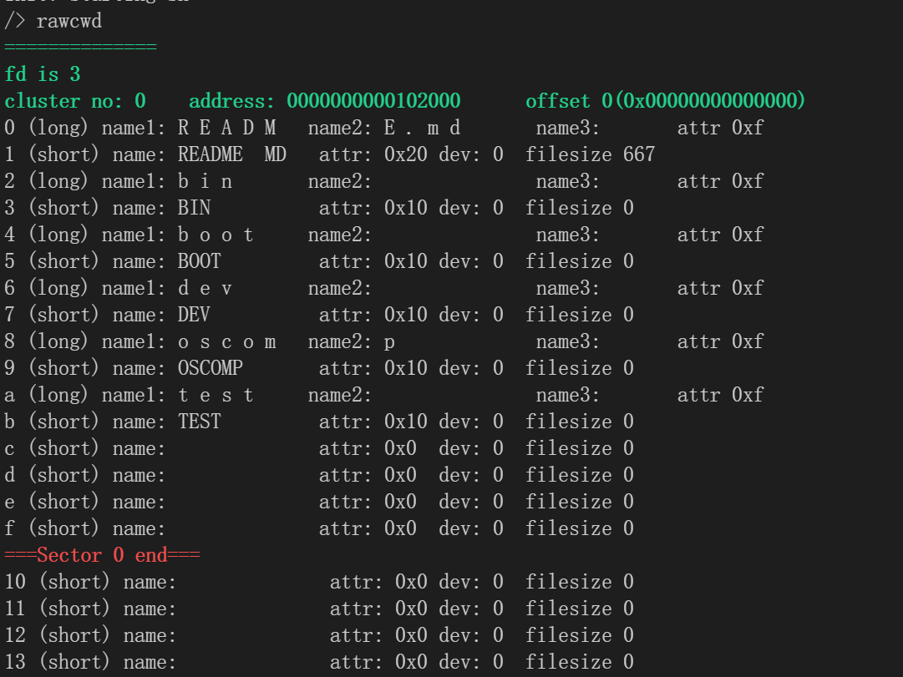

## rustsbi移植记录

1. 修改qemu选项中的bios为rustsbi-qemu

   ```
   QEMUOPTS = -machine virt -bios bootloader/sbi-qemu -kernel _kernel -m 128M -smp $(CPUS) -nographic
   ```

   make报错：

   

   由于找不到描述sbi具体行为的手册，因此只能推测：当设置了-bios bootloader/sbi-qemu后，这个sbi固件会被放在8000000的地址处，由于此时kernel.ld中依旧指定kernel从8000000开始，所以两者发生了冲突

2. 设置kernel.ld中的kernel起始内存地址：

   ```
   . = 0x82000000;
   ```

   make qemu，可以看到此时成功运行，但是系统会卡住

   

   从上图中我们也可以窥见rustsbi大概做了哪些工作：

   - misa：reporting the ISA supported by the hart

     ISA为riscv64，且支持了ACDFIMSU这些拓展

   - 设置mideleg，委派了s-mode soft/timer/external 这些中断

   - 设置了medeleg，委派了一些异常给s-mode

   - 设置了physical memory的一些属性

   - 最后会跳到supervisor的开始位置80200000

   解决：图中的地址是80200000，而我设置的地址是82000000，两者根本不匹配

3. rustsbi帮我们完成了一系列和m-mode寄存器，机器相关的初始化工作，这与xv6中原先做m-mode初始化工作的start.c重合，所以我们需要移除start.c

   首先分析一下start.c中哪些工作sbi尚且没有完成：

   - 预留的stack

      ```c
      // entry.S needs one stack per CPU.
      __attribute__((aligned(16))) char stack0[4096 * NCPU];
      ```

   - 和时钟相关的处理

   - 置hartid到tp寄存器中

      ```c
      // keep each CPU's hartid in its tp register, for cpuid().
      int id = r_mhartid();
      w_tp(id);
      ```

   - 置s-mode的相关寄存器，由于sbi只是对m-mode下的寄存器进行了初始化，所以s-mode的寄存器仍需要我们自己来处理

      ```c
      w_sie(r_sie() | SIE_SEIE | SIE_STIE | SIE_SSIE);
      ```

将预留的stack放到main中

> 其实只要确保最终编译得到的内核镜像的数据段中会留出这个空间就行

1. 处理时钟相关的问题，引入sbicall

   ```c
   struct sbiret sbi_set_timer(uint64 stime_value) {
       // stime_value is in absolute time.
       SBI_CALL_1(TIMER_EXT, 0, stime_value)
   }
   ```

2. 另外，原先entry.S中为每个CPU设置栈的过程需要做改动

   由于原xv6中，entry.S先于start.c执行，因此处于m-mode，所以可以对mhartid进行访问，而加入sbi后，sbi跳转到kernel时就处于s-mode中，所以需要修改entry.S

   不过既然我们无法访问mhartid，那么要怎么获取这个参数呢

   在参考了学长的实现后发现，rustsbi会将mahrtid置入a0寄存器中，所以我们可以通过访问a0寄存器来访问hartid

   此外还要注意，需要把hartid放到tp寄存器里，也在这里完成


## functional printf/sprintf

在OS的开发过程中，调试时我们经常需要使用输出（printf大法）来确保程序的行为与我们预期的相符，而原先xv6对printf的format的支持非常有限，因此我们从Linux中移植了支持绝大部分输出format的printf和sprintf


## thread_saniter

内核中并发问题是一个较难处理的问题，可能会因为对临界区的保护不够或者错误的保护导致数据竞争等问题的出现，为此我们移植了thread_saniter来对潜在的数据竞争进行检测

可以使用：

```bash
make KCSAN=1
```

开启KCSAN选项，启用数据竞争的检查(saniter)


## 规范化项目开发

考虑到我们队伍中每个人的编码习惯都略有差别，而在团队协作开发的过程中，不同的编码习惯会使得内核的代码风格混乱，为此我们使用clang-format来规范代码的风格

可以使用：

```bash
make format
```

对代码进行格式化


## debug相关系统调用

当操作系统启动之后，我们可以使用自行编写的用户程序对我们的os实现的正确性进行验证，从用户的角度来看，操作系统提供了一系列的系统调用供用户使用，除此之外，用户程序没有办法访问到内核中的数据结构和状态。秉承`程序是一个状态机`的思想，任何的状态都可以被输出追踪，为此，我们增加了一系列的用于调试的系统调用，它们的系统调用号从500开始

```tbl
# debug
500 print_pgtable sys_print_pgtable
501 print_vma     sys_print_vma
502 print_rawfile    sys_print_rawfile
```

初赛阶段，我们增加了以上的3个系统调用，分别可以打印出进程的页表，vma区域以及某个文件在FAT文件系统上的”生“数据

我们还在sys_print_rawfile这个系统调用之上封装了一个实用的用户程序：rawcwd



该用户程序可以起到类似ls的作用，不过展示出的FCB的字段都是FAT文件系统上的字段，比如长短目录项、attribute等，此外我们可以通过该程序获取到文件在文件系统镜像中的起始地址，以及占用的扇区/簇数量等


## 测试

os是一个庞大的程序，在os的开发过程中，不可避免的会遇到很多的实现错误，如果这些错误并没有直接让系统panic，让我们直接观测到Failure，那么这些错误就会潜藏在代码中，逐渐积累，像滚雪球一般越积越多，当我们观察到这些错误带来的panic时，其实中间已经隔了很多层，调试的成本也将大大增加。因此一个强大而完备的测试是非常有必要的。xv6操作系统自身带有一个usertests，其中包含了数十个关于文件系统、内存、进程的测试程序，我们移植并且适配、增强了这个测试，在整个初赛阶段中不断的跑测试，以确保内核实现的正确性