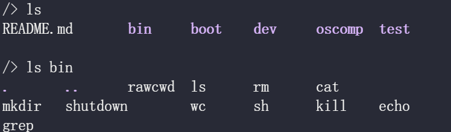
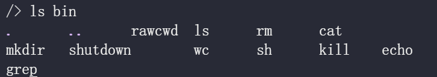

#### 第一个用户程序init的启动

##### user_init

在我们的操作系统完成一系列初始化任务之后，它会执行user_init来初始化第一个进程——init，更准确的说，**我们通过user_init创造了init进程的"壳子"**

```c
void user_init(void) {
    struct proc *p = NULL;
    p = create_proc();  // 创建进程的壳子,其中包含了该进程的初始化上下文
    initproc = p;
    safestrcpy(p->name, "/init", 10);
    TCB_Q_changeState(p->tg->group_leader, TCB_RUNNABLE); // 放入就绪队列
    release(&p->lock);
    return;
}
```

user_init是一段功能很清晰简单的代码，它并没有加载init进程的可执行文件，也没有完成诸如初始化用户栈，分配页表等进程启动必要的工作，而**仅仅完成了两个工作：**

1. 通过create_proc创造一个进程的壳子，同时**创造了该进程的初始化上下文：**

   ```c
   t->context.ra = (uint64)thread_forkret;
   t->context.sp = t->kstack + PGSIZE;
   ```

   - ra中保存了该进程**被调度后所跳转到的地址**，即thread_forkret
   - sp中保存了该进程的内核栈

2. **将该进程放入了就绪队列中**


##### thread_forkret

在操作系统完成以上的初始化后，它会运行调度器选择可运行的进程，而此时整个就绪队列中仅有一个进程，也就是我们刚刚在user_init中创建的init进程，调度器切换上下文到init的上下文，开始执行thread_forkret：

```c
void thread_forkret(void) {
    // Still holding p->lock from scheduler.
    release(&thread_current()->lock);
    if (thread_current() == initproc->tg->group_leader) {
        init_ret();
    }
    thread_usertrapret();
}
```

thread_forkret中判断该执行流是否是init，如果是的话，就执行initret


##### initret

```c
void init_ret(void) {
    extern struct superblock fat32_sb;
    fat32_fs_mount(ROOTDEV, &fat32_sb); // initialize fat32 superblock obj and root inode obj.
    proc_current()->_cwd = fat32_inode_dup(fat32_sb.root);
    proc_current()->tg->group_leader->trapframe->a0 = do_execve("/boot/init", NULL, NULL);
}
```

在initret中，我们才调用do_execve真正的加载并且初始化了init进程，同时这里还会完成文件系统的初始化

> 为什么在第一个用户进程这里才进行文件系统的初始化？
>
> 如果我们在操作系统初始化的时候同时执行文件系统的初始化，此时由于会进行读磁盘的操作，在读磁盘时会使**进程**休眠，而操作系统初始化时并没有进程的概念，也就谈不上让这个进程休眠了，因此我们需要把文件系统初始化这个工作放到有进程的概念的时候，也就是初始化第一个用户进程init的时候

在完成了do_execve之后，init进程回到用户态，此时就正式的开始执行用户程序了！


#### init做了什么

1. 创建设备文件console.dev

   ```c
   if(openat(AT_FDCWD,"/dev/console.dev", O_RDWR) < 0){
       mknod("/dev/console.dev", CONSOLE,0);
       openat(AT_FDCWD,"/dev/console.dev", O_RDWR);
   }
   ```

   init进程首先调用mknod命令创建设备文件console.dev，对这个文件的写入和读取就是对控制台的输出和输入

   由于这是第一个用户程序，因此此时该进程的fd table为空，所以执行openat会返回0号文件描述符，也就对应了stdin

2. 打开标准输出和标准错误输出

   ```c
     dup(0);  // stdout
     dup(0);  // stderr
   ```

   通过dup系统调用，将对stdout和stderr的访问也指向console.dev文件

3. 启动shell

   ```c
       pid = fork();
   	...
       if (pid == 0) {
         execve("/bin/sh",argv,envp);
         printf("init: exec sh failed\n");
         exit(1);
       }
   ```

   在完成了stdin/stdout/stderr的初始化工作后，init进程调用fork+execve启动shell进程

   shell进程启动后，用户就可以与系统进行交互，也就可以使用系统提供的一系列服务了

4. 此外，init进程还为一切没有父进程(父进程先于子进程退出时)的进程执行收尸(wait)操作

   ```c
   for(;;){
       wpid = wait((int *) 0);
   	...
   }
   ```


#### shell

当前我们的shell支持以下功能：

- 管道

  

- 重定向

  

- 列表命令执行

  

- 支持环境变量的使用

  > 目前仅使用了PATH环境变量

  

- 后台任务


#### 用户程序

处理shell之外，我们还支持了一系列简单的用户程序，并且编写了一些帮助调试的用户程序

- ls: 列出当前目录下的文件
- rm: 删除文件 
- cat: 将指令文件输出到标准输出
- mkdir: 创建目录
- shutdown：关机
- wc: 统计文件的行数，字符数
- kill: 强制杀死某进程
- echo: 输出
- grep: 支持简单正则的匹配
- rawcwd(用于文件系统调试的用户程序)

我们把这些用户程序放在文件系统镜像的bin(binary)目录中，同时由于我们的shell支持了PATH环境变量，我们可以在任何目录下使用这些程序




