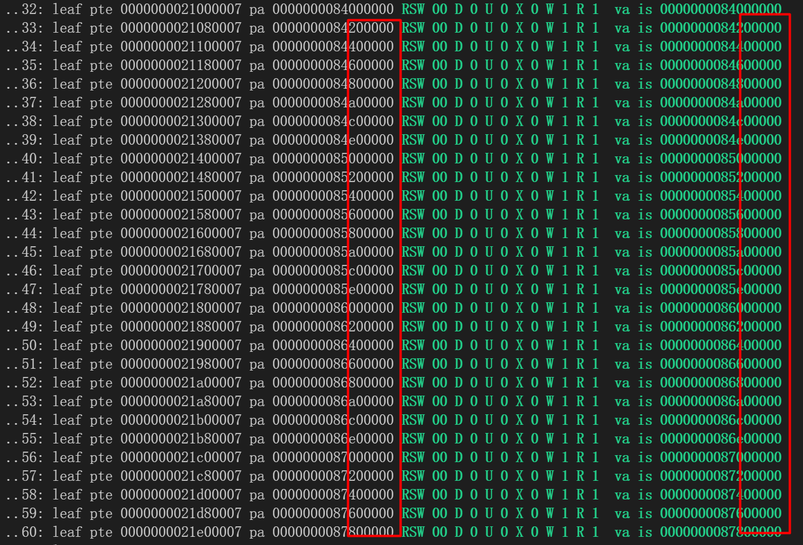

# 内存管理

## 初始化

在系统的初始化阶段(main)，需要完成一系列的初始化工作，内存相关的初始化任务分成两个部分，分别是**物理内存分配器的初始化**，**内核页表的建立/每个核启动分页**

1. 物理内存分配器的初始化

   ```c
   mm_init();
   ```

   我们的内核采用伙伴系统的物理内存管理方式，因此在系统的启动阶段需要初始化伙伴系统的相关数据结构

2. 建立内核页表，启动分页

   ```c
   kvminit();     // create kernel page table
   ```

   我们使用kvminit这个接口创建内核用的页表，该页表采用直接映射的策略，即虚拟地址和物理地址一一对应

   在创建内核页表后，我们为每个核都开启分页：

   ```c
   w_satp(MAKE_SATP(kernel_pagetable));
   ```

   由于内核并不会对内核页表进行修改，因此多个核可以共享一份内核页表


#### **物理内存布局**

```
    +---------------------------+ <-- 0x80000000
    |           sbi             |
    +---------------------------+ <-- rust-sbi jump to 0x80200000
    |     kernel img region     |
    +---------------------------+ <-- kernel end
    |    page_metadata region   |
    +---------------------------+ <-- START_MEM
    |          MEMORY           |
    |           ...             |
    +---------------------------+ <-- PHYSTOP
```

目前我们内核中的物理内存布局如上图所示

- qemu的内存从0x80000000开始

- 0x80000000~0x80200000

  由于我们使用了rust-sbi，而sbi会使用最开始的一块物理内存空间，因此我们需要把这块地址空间专门为sbi留出来

- kernel img region

  从0x80200000开始的一段连续的地址空间是kernel的映像位置

- page_metadata region

  从kernel的end地址开始（链接脚本kernel.ld中的end）到START_MEM，我们预留一部分的内存空间以保留页面的元数据；随着我们内核的开发过程，kernel img的大小会逐渐变大，总共的可用的物理内存数量并不固定，因此我们没有在kernel的数据区中为page_metadata区域保留一块定长的空间，而是将这块空间放置在了kernel img之后，以保证这块区域的大小可以动态调整

- START_MEM~PHYSTOP

  这部分区域就是所有可用于分配的物理内存空间，其中PHTSTOP根据qemu的-m ...参数设定的不同而不同


## 物理内存管理

- 基本思想：我们使用伙伴系统的物理内存管理方式，伙伴系统的基本思想是将物理内存划分成连续的块，以块为基本单位进行分配，不同块的大小可以不同，每个块都由一个或多个连续的物理页组成，物理页的数量是$2^n$次幂


- 配置选项：

  ```c
  #define BUDDY_MAX_ORDER 13
  ```

  我们可以通过修改`BUDDY_MAX_ORDER`配置伙伴系统的最大的可分配块，当其值为13时，表示伙伴系统的最大块包含2^13个物理页面

- 物理内存分配主要接口

  - 分配物理内存

    ```c
    void *kzalloc(size_t size);
    void *kmalloc(size_t size);
    ```

    `kmalloc`根据传入的size，调用底层的伙伴系统接口，分配>=size大小的物理块

    `kzalloc`在分配物理块的同时清空该物理块，以确保返回给调用者的是一个全0的物理块

  - 释放物理内存

    ```c
    void kfree(void *);
    ```

  - 获取当前可用物理内存

    ```c
    uint64 get_free_mem();
    ```

  - 共享物理页

    ```c
    void share_page(uint64 pa);
    ```

    该接口会复用当前物理块，用于Copy-On-Write


## 虚拟内存管理

我们使用riscv-Sv39的分页策略，即三级页表的管理方式,Sv39分页策略下的pte如下图所示：


- Sv39的分页策略中，虚拟地址空间的大小为39位，虚拟地址被分成几个部分：


  其中的VPN[i]作为第3-i次页表查找时的页表内的页表项偏移

- 除此之外，我们还使用到了PTE的其余权限位：

  - PTE_RSW，用于实现COW
  - PTE_D，在写回磁盘时，用于标识该页是否是脏页

- 虚拟内存管理选项：

  ```c
  #define COMMONPAGE 0
  #define SUPERPAGE 1 /* 2MB superpage */
  ```

  我们支持了大页映射，调用虚拟内存接口时，根据传入的参数的不同，底层的接口会分别映射/解映射一个普通页，大页


## 地址空间管理

在实现mmap系统调用的过程中，我们引入了基于VMA的地址空间管理策略

VMA的数据结构定义如下：

```c
struct vma {
    enum {
        VMA_MAP_FILE,
        VMA_MAP_ANON, /* anonymous */
    } type;
    struct list_head node;
    vaddr_t startva;
    size_t size;
    uint32 perm;

    int used;
    int fd;
    uint64 offset;
    struct file *fp;
};
```

在决赛阶段，我们将会全面引入基于VMA的地址空间管理方式


## 支持的特性以及优化

### COW

- 最朴素的fork系统调用实现会为子进程分配等同于父进程的内存空间大小，而绝大多数情况下，fork的使用都紧随execve的调用，比如当我们在shell中敲入命令时，shell会以fork+execve的组合启动该程序，在execve中，会将之前的页表以及分配的物理内存全部释放，这就会之前的fork中做的分配内存的工作变成无用功。因此我们实现了支持copy-on-write的fork/clone

- 实现思路：写时复制(Copy-On-Write)的核心是在创建进程时仅仅复制父进程的页表而不分配物理内存，并且将父进程和子进程的页表都设置为只读的（通过清除PTE_W位实现），当子进程/父进程在运行过程中出现了对只读页的写入时，会触发一个STORE_PAGE_FAULT，随后在pagefault的处理函数中，我们检查写入的页是否是一个共享的COW页，还是一次非法的操作，如果是前者，我们为其分配物理内存，并且修改页表的PTE_W位，如果是后者，我们就杀死该进程


此外，我们使用PTE中的RSW(reserved)位来标识这个页是一个共享的COW页，还是一个普通的只读页

```c
#define PTE_SHARE (1L << 8)    // identify if the page is shared
#define PTE_READONLY (1L << 9)
```

- 如果页表中的PTE_SHARE置位了，则表明该页是一个共享页，进一步通过PTE_READONLY位来判断该页是否是只读的
- 如果PTE_SHARE没有置位，则该页只是一个普通的页，此时如果触发了STORE PAGEFAULT，内核会直接杀死该进程


##### superpage

一般的多级页表中，并非只有最后一级的页表项能够指向物理页，中间级的页表项也可以指向物理页，即leaf-pte可以是除了最底层的pte之外的pte，在riscv下，标识一个pte是否是leaf-pte是通过PTE_X,PTE_W,PTE_R这3个bit的组合实现的，当这3个bit的值全都是0时，表示该PTE指向下级页表（non-leaf pte），否则这就是一个leaf-pte

由此在SV39的分页策略下，一个leaf-pte可以对应一个4KB的页，也可以对应2MB（4KB * 512）的页，最大的可支持的页的大小是1GB（2MB * 512）,考虑到1GB的页的使用场景非常有限且会导致较大的内部碎片，因此我们只支持了2MB的大页。

硬件上的TLB是一个有限的资源，在引入了大页机制前，访问2MB的内存需要512个TLB，引入了2MB的大页机制后，访问2MB的内存只需要1个TLB,同时TLB的命中率将大大提高，有效缓解了TLB缓存项不够用的问题；另一方面，大页减少了页表的级数，从而在一定程度上提高了查询页表的效率

当前，对于内核的页表的管理，我们使用了大页的管理机制，此外，对于大于2MB的应用程序、进程的堆空间管理，我们都引入了大页的映射机制

如图为内核页表的一部分，可见其中的页表项采用了2MB的superpage：




##### 多核物理内存分配优化

使用伙伴系统进行物理内存分配时， 会进入到一段临界区中，此时其他的hart如果也要做内存分配，就只能干等，实际上每次只有一个核心能够执行内存分配的操作。为了进一步提高多核的效率，我们将整个连续的物理内存划分成NCPU段物理内存池，每个CPU拥有其中的一部分，并且在操作系统初始化时，同时为每个核的内存池进行初始化。通过这样的设计，多个核就可以同时执行内存分配操作，并发的分配物理页

物理内存池的数据结构如下：

```c
struct phys_mem_pool {
    uint64 start_addr;
    uint64 mem_size;
    struct spinlock lock;
    ...
};
```

每个核都拥有一段这样的物理内存池，因此多核可以并发的进行内存分配，由于此时每个核能够分配的物理内存上限仅为总共可用的物理内存的1/NCPU，因此在每个核自己的物理内存池分配完之后，需要用一种方式去其他的CPU的物理内存池中“偷”一部分物理内存，此时可以通过`steal_mem`接口“偷取“其余核的一部分内存