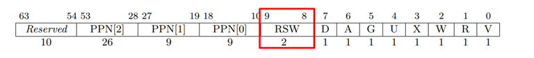
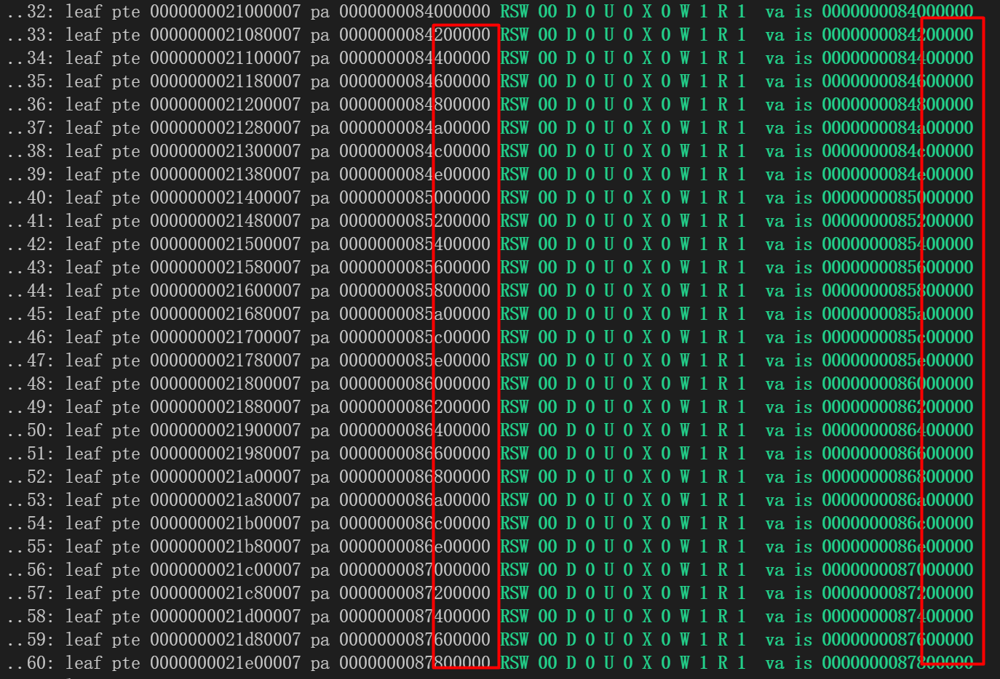

### COW

- 最朴素的fork系统调用实现会为子进程分配等同于父进程的内存空间大小，而绝大多数情况下，fork的使用都紧随execve的调用，比如当我们在shell中敲入命令时，shell会以fork+execve的组合启动该程序，在execve中，会将之前的页表以及分配的物理内存全部释放，这就会之前的fork中做的分配内存的工作变成无用功。因此我们实现了支持copy-on-write的fork/clone

- 实现思路：写时复制(Copy-On-Write)的核心是在创建进程时仅仅复制父进程的页表而不分配物理内存，并且将父进程和子进程的页表都设置为只读的（通过清除PTE_W位实现），当子进程/父进程在运行过程中出现了对只读页的写入时，会触发一个STORE_PAGE_FAULT，随后在pagefault的处理函数中，我们检查写入的页是否是一个共享的COW页，还是一次非法的操作，如果是前者，我们为其分配物理内存，并且修改页表的PTE_W位，如果是后者，我们就杀死该进程


具体实现时，我们使用了pte中预留的2bit的PTE_RSW



```c
#define PTE_SHARE (1L << 8)    // identify if the page is shared
#define PTE_READONLY (1L << 9) //
```

- PTE_SHARE，表明该页是否是一个COW页，即是否被共享
- PTE_READONLY，为了使COW页触发pagefault，在进行写时拷贝的时候会清空pte中的pte_w，因此需要额外的位来表示该页本身是否是一个可写的页，因此我们使用RSW中的一个bit来标识该页是否可写/只读


在触发pagefault时，会对该页的pte中的flags进行检查，以判断该页是否是一个cow page：

```c
int is_a_cow_page(int flags) {
    /* write to an unshared page is illegal */
    if ((flags & PTE_SHARE) == 0) {
        PAGEFAULT("cow: try to write a readonly page");
        return 0;
    }

    /* write to readonly shared page is illegal */
    if ((flags & PTE_READONLY) > 0) {
        PAGEFAULT("cow: try to write a readonly shared page");
        return 0;
    }
    return 1;
}
```

- 如果页表中的PTE_SHARE置位了，则表明该页是一个共享页（COW页），进一步通过PTE_READONLY位来判断该页是否是只读的
- 如果PTE_SHARE没有置位，则该页只是一个普通的页，此时如果触发了STORE PAGEFAULT，内核会直接杀死该进程


### 懒分配

在引入了基于VMA的管理方式之后，对于mmap调用，我们采用了懒分配的处理优化

具体的说，每当进程调用mmap系统调用映射了一块内存区域时，内核中仅为其分配VMA，但不分配物理内存，也不填写页表

```c
// do_mmap
if (flags & MAP_ANONYMOUS || fp == NULL) {
    if (vma_map(mm, mapva, length, mkperm(prot, flags), VMA_ANON) < 0) {
        return MAP_FAILED;
    }
} else {
    if (vma_map_file(mm, mapva, length, mkperm(prot, flags), VMA_FILE, offset, fp) < 0) {
        return MAP_FAILED;
    }
}
```

以上代码为内核中do_mmap的处理，mmap根据FLAGS为MAP_ANONYMOUS还是MAP_FILE，分配VMA_ANON和VMA_FILE

可见在mmap中不包含内存分配以及页表填写等处理


当用户程序访问到mmap映射的内存区域时，触发一个pagefault，在经过权限检查后（见doc:pagefault），为VMA分配内存，同时填写页表

```c
uvmalloc(pagetable, PGROUNDDOWN(stval), PGROUNDUP(stval + 1), perm_vma2pte(vma->perm));
if (vma->type == VMA_FILE) {
    paddr_t pa = walkaddr(pagetable, stval);

    fat32_inode_lock(vma->vm_file->f_tp.f_inode);
    fat32_inode_read(vma->vm_file->f_tp.f_inode, 0, pa, vma->offset + PGROUNDDOWN(stval) - vma->startva, PGSIZE);
    fat32_inode_unlock(vma->vm_file->f_tp.f_inode);
}
```

通过懒分配的设计，可以极大程度的节省不必要的内存开销以及时间开销


### 大页映射

一般的多级页表中，并非只有最后一级的页表项能够指向物理页，中间级的页表项也可以指向物理页，即leaf-pte可以是除了最底层的pte之外的pte，在riscv下，标识一个pte是否是leaf-pte是通过PTE_X,PTE_W,PTE_R这3个bit的组合实现的，当这3个bit的值全都是0时，表示该PTE指向下级页表（non-leaf pte），否则这就是一个leaf-pte

由此在SV39的分页策略下，一个leaf-pte可以对应一个4KB的页，也可以对应2MB（4KB * 512）的页，最大的可支持的页的大小是1GB（2MB * 512）,考虑到1GB的页的使用场景非常有限且会导致较大的内部碎片，因此我们只支持了2MB的大页。

硬件上的TLB是一个有限的资源，在引入了大页机制前，访问2MB的内存需要512个TLB，引入了2MB的大页机制后，访问2MB的内存只需要1个TLB,同时TLB的命中率将大大提高，有效缓解了TLB缓存项不够用的问题；另一方面，大页减少了页表的级数，从而在一定程度上提高了查询页表的效率

当前，对于内核的页表的管理，我们使用了大页的管理机制，此外，对于大于2MB的应用程序、进程的堆空间管理，我们都引入了大页的映射机制

如图为内核页表的一部分，可见其中的页表项采用了2MB的superpage：

