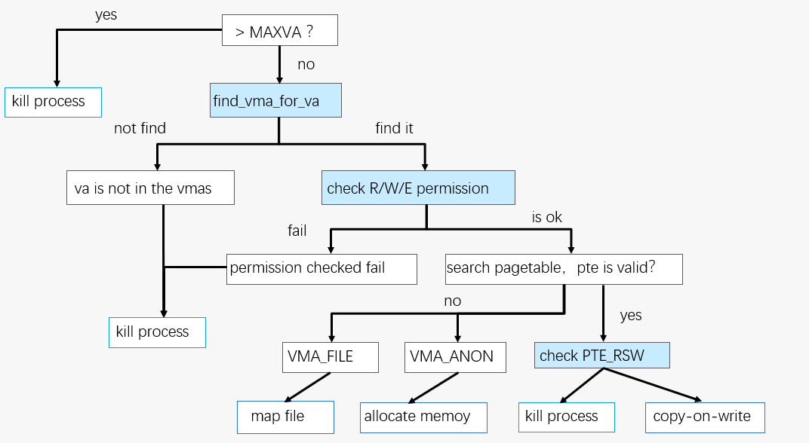

## pagefault处理流程



我们的操作系统在用户触发pagefault时，进行相应的处理，并实现了COW与懒分配

pagefault的具体流程如上图，具体的说，当用户触发了一个pagefault时：

1. 检查该访问的虚拟地址是否超过了虚拟地址的上界MAXVA

   如果超出了，则杀死该进程，否则继续

   ```c
   /* the va exceed the MAXVA is illegal */
   if (PGROUNDDOWN(stval) >= MAXVA) {
       PAGEFAULT("exceed the MAXVA");
       return -1;
   }
   ```

2. 根据该虚拟地址va，在进程的vma中进行查找（通过find_vma_for_va接口）

   如果在进程的所有vma中都没有找到该va，则杀死该进程

   ```c
   struct vma *vma = find_vma_for_va(proc_current()->mm, stval);
   if (vma != NULL) {
       ...
   } else {
       PAGEFAULT("va is not in the vmas");
       return -1;
   }
   ```

3. 找到vma后，将scause中的pagefault的类型，以及vma的访问权限进行匹配；

   - 如果是STORE_PAGEFAULT，则要求vma具有写入的权限(PERM_WRITE)
   - 如果是LOAD_PAGEFAULT，则要求vma具有读取的权限(PERM_READ)
   - 如果是INSTRUCTION_PAGEFAULT,则要求vma具有执行的权限PERM_EXEC

   如果该vma并不支持该pagefault的访问类型，说明当前的访问不合法，则杀死该进程

   ```c
   #define CHECK_PERM(cause, vma) (((cause) == STORE_PAGEFAULT && (vma->perm & PERM_WRITE))  \
                                   || ((cause) == LOAD_PAGEFAULT && (vma->perm & PERM_READ)) \
                                   || ((cause) == INSTRUCTION_PAGEFAULT && (vma->perm & PERM_EXEC)))        
   if (!CHECK_PERM(cause, vma)) {
       PAGEFAULT("permission checked failed");
       return -1;
   }
   ```

4. 检查用户的页表中是否已经存在了该va对应的pte

   - 如果存在，则说明这是一个COW的页（COW页不分配物理内存，但填写页表），为其进行写时复制相应的处理；
   - 如果pte不存在，说明这是一个懒分配的页（懒分配的页仅分配VMA，不分配物理内存，也不填写页表），则分配内存，填写页表，并且如果该VMA的类型是VMA_FILE，再完成映射文件的处理

   ```c
   if (pte == NULL || (*pte == 0)) {
       uvmalloc(pagetable, PGROUNDDOWN(stval), PGROUNDUP(stval + 1), perm_vma2pte(vma->perm));
       if (vma->type == VMA_FILE) {
           paddr_t pa = walkaddr(pagetable, stval);
   
           fat32_inode_lock(vma->vm_file->f_tp.f_inode);
           fat32_inode_read(vma->vm_file->f_tp.f_inode, 0, pa, vma->offset + PGROUNDDOWN(stval) - vma->startva, PGSIZE);
           fat32_inode_unlock(vma->vm_file->f_tp.f_inode);
       }
   } else {
       pa = PTE2PA(*pte);
       flags = PTE_FLAGS(*pte);
       ASSERT(flags & PTE_V);
       /* copy-on-write handler */
       if (is_a_cow_page(flags)) {
           return cow(pte, level, pa, flags);
       } else {
           return -1;
       }
   }
   ```

