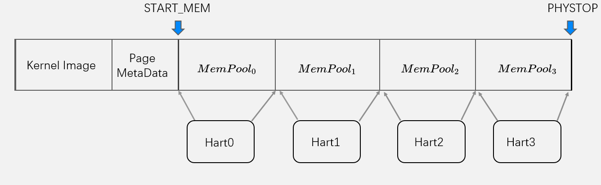

## 伙伴系统与内存池

我们使用伙伴系统的物理内存管理方式，伙伴系统的基本思想是将物理内存划分成连续的块，以块为基本单位进行分配，不同块的大小可以不同，每个块都由一个或多个连续的物理页组成，物理页的数量是$2^n$次幂

由于伙伴系统是对页进行管理分配的一种算法，因此我们需要对每个页创立一个管理的数据结构page

```c
struct page {
    // use for buddy system
    int allocated;
    int order;
    struct list_head list;

    // use for copy-on-write
    struct spinlock lock;
    atomic_t refcnt;

    // for i-mapping
    uint64 flags;
    struct address_space *mapping;
    
    // pagecache index
    uint64 index;
};
```

与伙伴系统相关的数据结构主要是：

```c
// use for buddy system
int allocated;
int order;
struct list_head list;
```

- allocated：表明该页是否已经被分配
- order：表示该内存块的次幂，每个伙伴系统块的大小为$2^{order}$的大小
- list：伙伴系统将每个order的内存块拉成一张链表，因此page里需要有链表的控制数据结构list


**内存分配**

分配内存时最底层调用`buddy_get_page`接口

```c
// buddy_get_page
for (int i = order; i <= BUDDY_MAX_ORDER; i++) {
    lists = &pool->freelists[i].lists;
    if (!list_empty(lists)) {
        page = list_first_entry(lists, struct page, list);
        list_del(&page->list);
        pool->freelists[page->order].num--;
        break;
    }
}
```

该接口遍历order~BUDDY_MAX_ORDER的伙伴系统的内存块链表，并且依次查询链表中是否包含可用的项

如果最终在i>order的链表中找到了可用的内存块，此时还要将该内存块进行分裂：

```c
if (page->order > order) {
    page = split_page(pool, order, page);
}
page->allocated = 1;
```


**内存回收**

```c
page->allocated = 0;

if (page->order < BUDDY_MAX_ORDER) {
    page = merge_page(pool, page);
}
...
list_add(&page->list, list);
```

内存回收时只需要将该内存块的allocated标识为1，同时把该page加到伙伴系统的链表中去即可

此外，由于之前分配内存的时候可能将一个内存块分裂成两个小的内存块，因此在回收时会调用merge_page接口，检查是否可以将几个大小相同的连续的内存块合并成一个大的内存块


## 多核内存池

在实现了伙伴系统的物理内存管理方式后，我们进一步把物理内存进行划分，为每个hart划分一块专属的内存池。

使用伙伴系统进行物理内存分配时， 会进入到一段临界区中，此时其他的hart如果也要做内存分配，就只能干等，实际上每次只有一个核心能够执行内存分配的操作。为了进一步提高多核的效率，我们将整个连续的物理内存划分成NCPU段物理内存池（NCPU为hart的数量），每个hart拥有其中的一部分，并且在操作系统初始化时，同时为每个核的内存池进行初始化。通过这样的设计，多个核就可以同时执行内存分配操作，并发的分配物理页



如上图所示，可用的物理内存的区域为：START_MEM~PHYSTOP，在最初的设计中，所有的核共享这一整块的内存区域，多核并发访问物理内存分配的效率较低

在引入物理内存池的优化后，将整段可用的物理内存进行划分，每个核都拥有一段相同大小的物理内存池，因此多核可以并发的进行内存分配，由于此时每个核能够分配的物理内存上限仅为总共可用的物理内存的1/NCPU，因此在每个核自己的物理内存池分配完之后，需要用一种方式去其他的CPU的物理内存池中“偷”一部分物理内存，此时可以通过`steal_mem`接口“偷取“其余核的一部分内存

```c
struct page *steal_mem(int cur_id, uint64 order) {
    struct page *page = NULL;
    for (int i = 0; i < NCPU; i++) {
        if (i == cur_id) {
            continue;
        }
        push_off();
        page = buddy_get_pages(&mempools[i], order);
        if (page != NULL) {
            return page;
        }
    }
    ASSERT(page == NULL);
    return page;
}
```

steal_mem会依次访问每个hart的内存池，并查看其中是否还有可用的内存

