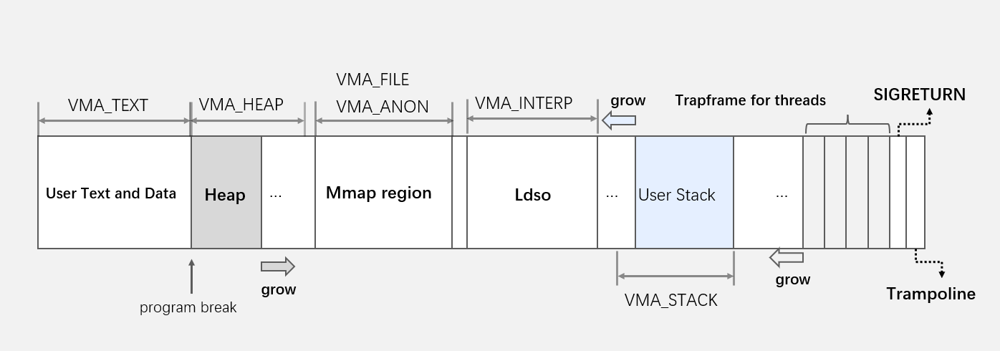

#### 进程的内存区域



我们的操作系统的内存管理部分使用基于VMA的管理方式，每个**进程**的内存管理整体上来说分成三个部分：

1. **共享的**部分：

   这部分主要是用于执行流切换的trampoline和用于信号的sigreturn

   - trampoline：用于进程的内核态用户态切换的代码
   - sigreturn：信号的handler返回时执行的代码

   对于这两部分的内存区域，只需要分配一次物理内存，随后每个进程都只需要填写页表指向这两个页的物理内存即可，不需要为其分配VMA

2. **TRAPFRAME**

   在我们的操作系统中，进程的每个线程都有自己独有的TRAPFRAME，每当调用clone并且FLAGS位中包含有CLONE_THREAD时，都会创建一个线程，并且在进程的页表中为该线程分配一个新的TRAPFRAME，每个线程进入内核时首先找到自己的trapframe，随后再保存上下文到它的相应的trapframe中

3. **独有的**部分：

   这部分使用VMA来进行管理，我们对不同用途的内存区域进行了不同的VMA的细分，具体的划分如下：

   ```c
   typedef enum {
       VMA_STACK,
       VMA_HEAP,
       VMA_TEXT,
       VMA_FILE,
       VMA_ANON,
       VMA_INTERP,
   } vmatype;
   ```

   - VMA_STACK是用户栈的部分，处于虚拟内存区域的高地址空间

     我们可以通过以下的接口来改变每个用户的栈的大小，其中ustack_page指示了初始状态时，用户栈占的页的大小

     ```c
     int uvm_thread_stack(pagetable_t pagetable, int ustack_page);
     ```

   - VMA_HEAP是用户的堆区，它的起始位置是程序的program break，也就是用户的代码段数据段的结束的位置，HEAP段的大小可以通过sbrk/brk这两个系统调用改变

   - VMA_TEXT是程序的代码段和数据段，在execve载入文件时进行分配

   - VMA_FILE和VMA_ANON用于mmap系统调用的映射，分别对应了文件和匿名的内存区域

   - VMA_INTERP是为动态链接器设置的VMA区域，我们为动态链接器预留从0x40000000开始的一块内存区域

     ```c
     #define LDSO 0x40000000
     ```
