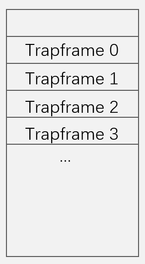

## 多核多线程

我们的内核支持多线程，此外，为了进一步发挥多线程的优势/执行效率，我们支持了在多个核上同时并行的运行一个进程的多个线程

为了实现多核并行执行多线程，首先要处理每个线程的执行流切换的问题，线程在进行内核态和用户态的切换时，需要将它的上下文保存在trapframe当中，而如果多线程同时在多个核上执行，它们可能会在同一时间将上下文保存在同一个trapframe里，导致前面的修改被后面的修改覆盖

可见仅有1个trapframe对于多线程来说是不够用的，因此在我们的os设计中，我们为每个线程都创建了一个独有的trapframe

在执行do_clone创建线程时，通过调用`uvm_thread_trapframe`接口来为该线程分配trapframe

```c
if ((t->trapframe = uvm_thread_trapframe(p->mm->pagetable, t->tidx)) == 0) {   
    ...
    return -1;
}
```

其中的t->tidx参数的含义是：该线程为当前进程中的第tidx个线程

`uvm_thread_trapframe`分配trapframe的策略是：从指定的地址开始，依次向下，递减的为每个线程分配内存，如下图所示：



如此一来，每个线程都有了自己的trapframe，剩下的问题是，在线程执行trampoline代码时要如何找到它的trapframe

每个进程的第一个线程的trapframe的地址是固定的，在内核中通过宏`TRAPFRAME`来控制，且每个TRAPFRAME的大小都固定为一个页的大小，所以线程可以通过计算偏移的方式来得到它的trapframe的地址

```c
TRAPFRAME - idx * PGSIZE
```

idx如果仅仅保存在tcb当中，线程在执行trampoline时同样无法访问到，因为这是内核中是数据结构，线程显然无法访问内核中的结构

因此我们需要把idx保存在一个线程能访问到的地方，即将tidx保存在寄存器中，我们的os中将tidx保存在sscratch中，每次线程从内核态返回用户态之前，都会写sscratch寄存器：

```c
// write thread idx into sscratch
w_sscratch(t->tidx);
```

当用户再次调用trampoline，从用户态进入内核态时，通过以下的汇编代码计算偏移，获取它的trapframe的地址，并放在a0寄存器中：

```asm
# get_trapframe
li a0, TRAPFRAME
li a1, 1024*4
csrr a2, sscratch
mul a1, a2, a1
sub a0, a0, a1
```

到此为止，每个线程都可以完成用户态内核态的执行流切换，从而也就支持了在多个核上并行的执行多线程


#### trampoline的适配

在原先的xv6的trampoline的设计中，使用了sscratch来辅助完成上下文保存的任务；而在我们的os中的多核并行执行多线程的流程中，同样使用sscratch来保存tidx，从而计算偏移。因此在trampoline的上下文保存的环节，我们不再使用sscratch，而是将寄存器预先保存到用户栈里

```asm
# save user a0 in stack
# so a0 can be used to get TRAPFRAME.
addi sp, sp, -32
sd a0, 0(sp)
sd a1, 8(sp)
sd a2, 16(sp)
```


#### COW的适配

原先的copy-on-write的流程仅仅填写页表，不拷贝内存

而事实上，在我们的trampoline的设计中，需要用到栈来保存寄存器，因此我们修改了我们的cow的处理逻辑

```c
/* for STACK VMA, copy both the pagetable and the physical memory */
if (pos->type == VMA_STACK) {
    for (uint64 offset = 0; offset < pos->size; offset += PGSIZE) {
        ...
        paddr_t new = (paddr_t)kzalloc(PGSIZE); // 分配物理内存
        ...
        memmove((void *)new, (void *)pa, PGSIZE); // 拷贝物理内存
        if (mappages(...) != 0) { // 填写页表
            panic("uvmcopy: map failed");
            return -1;
        }
    }
    continue;
}
```

在进行cow处理时，对vma的类型进行判断，如果是VMA_STACK类型（对应栈的区域）

则完成完整的拷贝流程：填写页表+分配物理内存+拷贝物理内存

以这种方式提前完成栈区域的拷贝，节省了随后的pagefault带来的处理的时间
