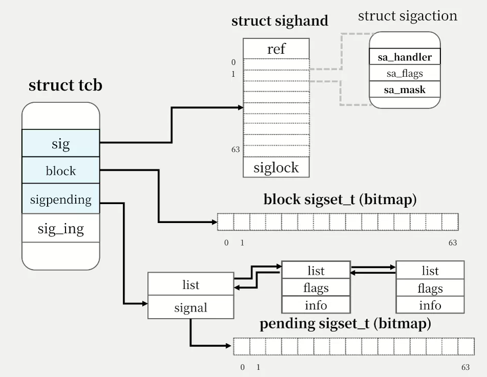
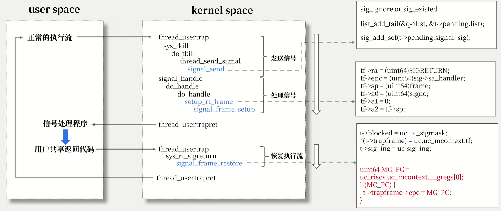
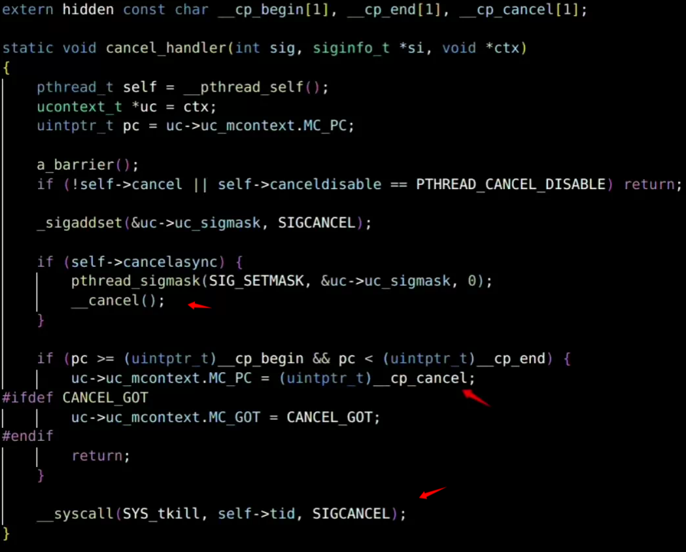

#### 信号系统的主要系统调用有哪些？

1. **sys_rt_sigaction**

为一个信号设置用户态handler。

2. **sys_rt_sigprocmask**

设置信号的block mask。

3. **sys_rt_sigreturn**

线程在用户态完成signal handler之后会调用这个系统调用回到内核态恢复原先的执行流。

4. **sys_kill**

向指定进程组中的所有线程发送特定信号。

5. **sys_tkill**

指定线程发送特定信号。


#### 信号系统的数据结构设计？

主要就是需要给线程设置一个handler的处理数组，然后就是设置一个block mask的bitmap表示当前线程阻塞的信号，最后就是设置一个pending list，表示当前线程待处理的信号队列。

线程中的主要字段如下：

```c
int sig_pending_cnt;       // have signal?
struct sighand *sig;       // signal
sigset_t blocked;          // the blocked signal
struct sigpending pending; // pending (private)
sig_t sig_ing;             // processing signal
```




#### 信号系统设计的难点是？

执行流的切换问题，如何保证一个线程在收到信号后能够及时处理信号，并正常执行用户态handler程序，最后还能恢复正常的执行流。



我们的设计是将处理信号放到了usertrapret，在线程返回用户态时会检查一下是否有信号需要处理，如果检查到pending_list非空，就的从头开始处理，处理一个就将这个信号从pending_list中删除。

需要注意的点：

1. 我们将trapframe和block mask还有当前处理的信号编号组合在一起压入了用户栈。
2. 我们通过将内核页表和用户页表共用一个SIGRETURN页面，实现了handler处理完毕后正常触发sig_return系统调用。
3. 在进行压栈的时候记得字节对齐。
4. a2 寄存器一定要赋值！

```c
tf->ra = (uint64)SIGRETURN;
tf->epc = (uint64)sig->sa_handler;
tf->sp = (uint64)frame;
tf->a0 = (uint64)signo;
tf->a1 = 0;
tf->a2 = tf->sp;
```

SIGRETURN 的内容如下：

```assembly
.section sigret_sec
.global __user_rt_sigreturn
__user_rt_sigreturn:
    li a7, 139 # SYS_rt_sigreturn
    ecall
```


#### 关于pthread_cancel的一些问题



1. 第一种执行流，直接进入pthread_exit然后线程就退出了。


2. 第二种执行流，在sig_return的时候需要设置一下epc，然后改变程序的用户态执行流。


3. 第三个执行流，防止多次触发SIGCANCEL这个信号，在处理一个信号的同时，不能多次重入处理这个信号，否则就死循环。

