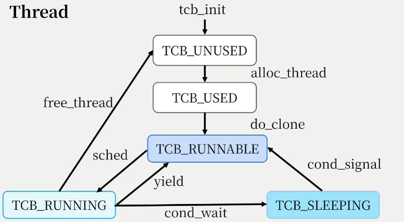
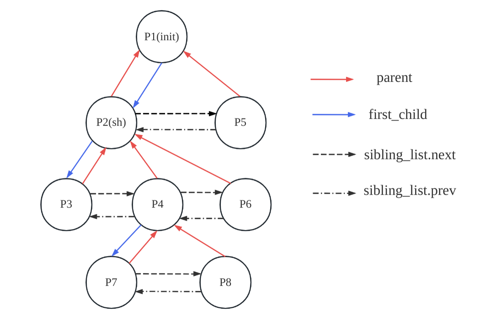
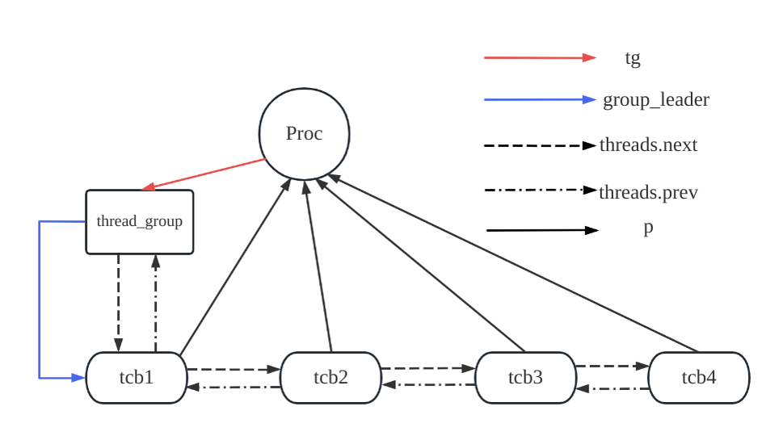
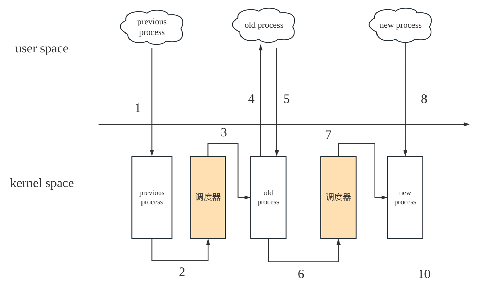
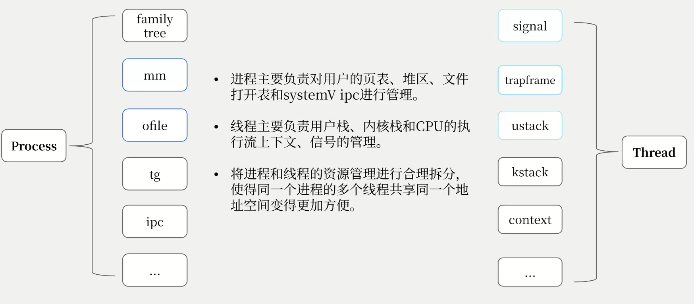

# 进程和线程

#### 首先是进程和线程的状态应该是怎样的？

1. ##### **进程作为资源管理的单位，有3个状态。**

PCB_UNUSED、PCB_USED和PCB_ZOMBIE

状态转移图如下：


由于我们的进程仅仅作为资源管理的单位，不作为调度单位，所以不需要PCB_SLEEPING、PCB_RUNNING和PCB_RUNNABLE这三个状态。

为了更加方便管理和调试，且考虑到内核很难出现一次性运行大量的进程，我们的进程是用一个全局的数组进行管理（可以动态调节），即需要在内核初始化的时候在proc_init将所有进程资源放入UNUSED队列中，然后设置进程的状态。

只要一个进程有一个线程还活着，不管是在PCB_SLEEPING、PCB_RUNNING还是PCB_RUNNABLE，我们都定义为PCB_UNUSED，只有当一个进程的线程组中的所有线程都退出时，即调用了exit系统调用，进程在释放完所有的线程资源后，就进入PCB_ZOMBIE状态，等待其父进程收尸。

当一个进程回收其一个PCB_ZOMBIE的子进程的时候，调用free_proc就可以释放并回收其内存资源，将进程的状态设置为PCB_UNUSED。

所有的进程状态转移都包括两个步骤：

1. 原子性地设置进程的状态字段。
2. 原子性地切换进程资源所在队列。

```c
PCB_Q_changeState(struct proc *p, enum procstate state_new);
```


2. **线程作为调度的单位，有5个状态。**

TCB_UNUSED、TCB_USED、TCB_RUNNING、TCB_RUNNABLE和TCB_SLEEPING。

状态转移图如下：



由于我们的线程作为调度的最小单元，即可以一个进程的多个线程同时在多个CPU上运行，所以我们线程的状态需要包含TCB_RUNNING、TCB_RUNNABLE和TCB_SLEEPING，这是和进程状态管理最大的不同。

和进程资源管理一样，我们假定系统每个进程最多有固定数量的线程，那么整个系统同时可以运行的最大线程数量就是一个定值。在系统启动时，通过tcb_init初始化线程数组，将其状态设置为TCB_UNUSED，并全部压入队列。

当调用alloc_thread时，一个新的线程被创建，此时只需要从TCB_UNUSED队列中弹出一个线程资源，将其状态设置为TCB_USED，放入UNUSED队列中。如果是clone系统调用使用了alloc_thread，那么就会在clone中将TCB_USED设置为TCB_RUNNABLE，并将资源放入就绪队列中。

系统启动后，每个CPU都会进入thread_scheduler，只要就绪队列runnable_t_q中有可用的资源，那么CPU就会从中取出一个，将其状态设置为TCB_RUNNING，并设置CPU资源结构体的thread字段，将调度器的context保留在context字段中。需要注意的是，我们将当前CPU运行的线程指针留在了CPU结构体中，所以不需要设置一个线程的运行队列，即running_t_q。在进行状态转换的时候我们也进行了单独地处理。

每次发生时钟中断，都会执行thread_yield函数，然后调用thread_sched，将当前的线程从TCB_RUNNING状态切换为TCB_RUNNABLE状态，CPU重新回到调度器对应的地址从就绪队列中再次挑出一个线程运行。

如果一个线程被杀死了或者正常退出，那么需要将其通过free_thread将其资源释放，并将状态切换为TCB_UNUSED。需要注意的是，如果线程处于TCB_SLEEPING状态，那么其需要从等待队列中删除，并切换为TCB_RUNNABLE状态，等待下次被CPU调度，转化为TCB_RUNNING状态，然后被杀死，最后释放线程资源。

我们内核中只要使用了wait后缀结尾的接口后，如果满足了对应同步原语（cond、semaphore和futex）休眠的条件，那么线程就会从TCB_RUNNING状态切换为TCB_SLEEPING状态，将其插入等待队列中，等待被唤醒。而使用了signal（这里也包括broadcast）后缀结尾的接口后，如果满足了对应同步原语的唤醒条件，那么线程就会从TCB_SLEEPING状态切换为TCB_RUNNABLE状态，等待下次被调度。

所有的线程状态转移都包括两个步骤：

1. 原子性地设置线程的状态字段。
2. 原子性地切换线程资源所在队列。

```c
TCB_Q_changeState(struct tcb *t, enum tcbstate state_new);
```


#### 进程和进程之间的关系

有一个很重要的问题，就是进程需要设置一个ZOMBIE状态，而线程不需要。原因是线程可以自行回收资源，但进程需要由父进程帮助回收。进程间的关系是分层的，依照创建与被创建关系构成树状结构、根节占（父进程）有管理叶节点（子进程）的职责。而线程间的关系是扁平的，线程只存在创建先后的关系，并不存在“父子线程”的关系。

基于此，我们需要用多叉树的数据结构维护父子进程之间的分层关系，并用一个链表维护进程和其线程之间的扁平结构。即进程需要维护下面这样的家族树的结构，我们采用的是一种孩子兄弟表示法来表示一颗多叉树。具体可以看下面这张图：



我们保留了xv6原始的设计（和Linux一样），每个进程可以通过parent指针快速得到父进程的结构体指针。即上面红色箭头所示。在内核中的多处地方需要用到parent指针：

1. getppid 系统调用
2. clone 系统调用
3. exit 系统调用
4. reparent 接口

需要注意的是上面的蓝色箭头表示每个进程的第一个子进程，即first_child，这是一个单向的箭头，而list.h提供的都是带头结点的双向循环链表，不支持不带头结点的双向循环链表的遍历，所以我们加了一个接口

```c
list_for_each_entry_safe_given_first(pos, head_f, member, flag)
```

结合sibling_list实现了子进程链表的遍历，将其用在了waitpid和reparent中。即我们通过first_child和sibling_list实现了给定一个进程，可以完成其子进程的增加、删除和遍历。

```c
void deleteChild(struct proc *parent, struct proc *child);
void appendChild(struct proc *parent, struct proc *child);
```

一定要记住，在执行deleteChild和appendChild的时候需要获取进程的自旋锁（保证原子性），否则会有并发的bug。

```c
// 增加一个子进程
acquire(&p->lock);
deleteChild(p, p_child);
release(&p->lock);
// 删除一个子进程
acquire(&p->lock);
appendChild(p, np);
release(&p->lock);
```


#### 进程和线程之间的关系

每个进程都有一个tg字段，其是一个struct thread_group的指针，如下：

```c
struct thread_group {
    spinlock_t lock; // spinlock
    tid_t tgid;      // thread group id
    int thread_idx;
    int thread_cnt;           // the count of threads
    struct list_head threads; // thread group
    struct tcb *group_leader; // its proc thread group leader
};
```

每个进程都有一个主线程，即group_leader，在申请一个新的进程时，一定会有一个主线程被申请，然后将其作为调度单位。需要注意的是每个线程的用户栈和内核栈是独立的，只有页表和文件打开表是共享的。每个线程具有独立的信号处理队列、trapframe和context。

进程的线程组的扁平结构如下所示：



通过proc结构体的thread_group和list.h可以十分容易地实现对进程的所有线程进行增加、删除和遍历。进程第一个创建的线程称为主线程，当主线程退出时，其他所有的线程都需要退出。某个非主线程退出时，其可以自己回收资源，不需要进入ZOMBIE状态等待回收。

如果对线程链表进程操作，一定要用lock自旋锁保护！还有需要注意的是thread_idx从0开始，表示下一个可以分配的线程编号（相对于本进程）。不同的线程对进程的共有资源进行访问也需要用lock保护。

可以通过tcb中的p字段来获取这个线程对应的进程结构体，可以通过当前CPU运行的线程快速得到正在运行的进程。


#### 进程的生命周期

1. **进程家族树**

```c
// proc family tree
// delete or append a child
void deleteChild(struct proc *parent, struct proc *child);
void appendChild(struct proc *parent, struct proc *child);
// debug 打印输出进程的子进程
void procChildrenChain(struct proc *p);
```

2. **获取当前CPU运行的进程**

```c
struct proc *proc_current(void);
```

3. **分配一个新的进程资源**

```c
struct proc *alloc_proc(void);
```

- 从unused_q队列中弹出一个进程资源。
- 通过原子指令分配一个pid。
- 初始化进程的家族树相关字段：first_child和sibling_list。
- 分配进程的页表。
- 分配进程的线程组结构体，并进行初始化。
- 切换进程的状态为PCB_USED。
- 构建从pid到进程指针的hash表映射。
- 带锁返回。

4. **创建一个带有主线程的进程资源**

```c
struct proc *create_proc();
```

- 分配一个新的进程资源。
- 分配一个新的线程资源。
- 将线程资源插入进程的线程组。
- 初始化线程的wait信号量，表示线程对应的进程的已经exit。
- 初始化线程的trapframe。
- 释放线程的锁。

5. **释放进程的资源**

```c
void free_proc(struct proc *p);
```

- 释放进程的页表。
- 释放进程的线程组资源。
- 删除从pid到改进程指针的hash表映射。
- 设置其他重要字段为0：如 pid、parent等。
- 切换进程的状态为PCB_UNUSED。

6. ##### 进程表的初始化

```c
void proc_init(void);
```

- 原子指令初始化next_pid和count_pid，分别用来表示下一个可以分配的pid和当前非PCB_UNUSED的进程数量。
- 初始化3个进程状态队列。
- 将进程表中的结构体的自旋锁进行初始化。
- 切换进程状态为PCB_UNUSED。

7. **设置进程被杀死和判断进程是否被杀死**

```c
void proc_setkilled(struct proc *p);
int proc_killed(struct proc *p);
```

8. **根据pid和hash表查找对应的进程结构指针**

```c
inline struct proc *find_get_pid(pid_t pid);
```

9. **clone系统调用的本体 do_clone**

```c
int do_clone(int flags, uint64 stack, pid_t ptid, uint64 tls, pid_t *ctid);
```

- 创建一个线程或者是创建一个进程+主线程。
- 拷贝trapframe。
- 设置返回值对应的寄存器a0。
- 拷贝页表。
- 复制文件打开表。
- 复制cwd，当前工作目录。
- 拷贝信号的挂起队列。
- 设置set_child_tid字段和clear_child_tid字段。
- 设置用户的栈顶指针。
- 设置进程的parent指针。
- 添加进程的父子关系。
- 切换进程的状态为PCB_RUNNABLE

10. **exit系统调用的主体 do_exit**

```c
void do_exit(int status);
```

- init进程不能退出。

- 关闭进程所有的文件打开表。

- 释放cwd的inode。

- 释放进程的所有线程。

- 将自己的所有子进程交给init进程回收（托孤）。

- 设置退出状态。（需要将传入的status左移8位）

- 切换进程状态为PCB_ZOMBIE。

- 用主线程的sema_wait_chan_parent告知父进程有子进程退出了。（同步信号量）
- 用主线程的sema_wait_chan_self告知父进程某个特定的子进程退出了。（同步信号量）
- 让出CPU，进行线程的调度。

11. 父进程回收子进程**waitpid**

```c
int waitpid(pid_t pid, uint64 status, int options);
```

- 如果进程没有子进程，就直接返回。
- 如果进程被杀死了，也直接返回。
- 使用主线程的sem_wait_chan_parent实现等待任意pid的子进程。
- 使用子进程主线程的sem_wait_chan_self实现等待特定pid的子进程。
- 回收某个状态已经切换为PCB_ZOMBIE的进程。
- 释放子进程的资源，将子进程的退出状态拷贝回用户空间。
- 从家族树中删除这个子进程。

12. **reparent**

进程退出时，向init进程进行托孤。

```c
void reparent(struct proc *p);
```

- 如果进程有子进程，就将非PCB_ZOMBIE状态的进程添加到init进程的子进程链表中。
- 如果进程已经退出，那么需要用信号量重新发送。
- （注意，这里需要操作三个进程：父进程、子进程和init进程，所以为防止data race，只能加锁保护）
- （注意，这里为了让init进程被ZOMBIE进程唤醒，必须要通过再次使用sema_signal）


#### 线程的生命周期

1. **tcb_init**

线程的全局数组的初始化。

```c
void tcb_init(void);
```

- 原子指令初始化next_tid和count_tid，分别用来表示下一个可以分配的tid和当前非TCB_UNUSED的线程数量。
- 初始化5个线程状态队列。
- 将线程表中的结构体的自旋锁进行初始化。
- 切换进程状态为TCB_UNUSED。

2. **获取当前CPU运行的内核级别线程指针**

```c
struct tcb *thread_current(void);
```

一定要关中断获取。

3. **分配一个新的线程资源**

```c
struct tcb *alloc_thread(void);
```

- 从unused_q队列中弹出一个线程资源。
- 通过原子指令分配一个tid。
- 分配线程的trapframe。
- 设置线程的待处理的信号数量为0。
- 分配线程的信号处理handler结构体sig，并初始化阻塞信号、信号挂起队列。
- 初始化线程的上下文context字段，并设置ra寄存器为thread_forkret的地址。
- 同时设置线程的内核栈的栈顶地址。
- 切换线程的状态为TCB_USED。
- 构建从tid到线程指针的hash表映射。
- 带锁返回。

4. **释放线程的资源**

```c
void free_thread(struct tcb *t);
```

- 释放trapframe的资源。
- 释放线程的tig资源。
- 删除hash表的tid到tcb指针的映射。
- 将其他字段设置为0。
- 一定要记住清空线程的所有挂起信号队列。

- 切换线程的状态为TCB_UNUSED。

5. **将某个线程join到进程中**

```c
void proc_join_thread(struct proc *p, struct tcb *t);
```

- 如果这个进程没有主线程，那么就需要将这个线程作为进程的主线程。
- 将线程插入进程的线程组中。
- thread_cnt自增。
- 设置线程的tidx。
- 设置线程的p字段。

6. **将某个线程从进程中分离**

```c
int proc_release_thread(struct proc *p, struct tcb *t);
```

- thread_cnt自减。
- 从进程的线程组中删除线程。
- 如果是最后一个线程，需要确保是主线程退出。

7. **进程释放线程组中所有的线程**

```c
void proc_release_all_thread(struct proc *p);
```

- 用list.h的轮子直接安全遍历所有的线程链表，逐个删除即可，需要用free_thread释放线程资源。
- 设置线程组中线程的数量为0。

8. **给进程中的所有线程发送信号。**

```c
void proc_sendsignal_all_thread(struct proc *p, sig_t signo, int opt);
```

- 初始化signal_info结构体
- 遍历线程组中的所有线程，向线程发送信号。
- 如果信号是SIGKILL，需要及时杀死进程。

9. **线程退出**

```c
void exit_thread(int status);
```

- 这个接口仅仅是释放一个线程的资源，需要清空context。
- 退出后需要进行线程调度。

10. **线程是否被杀死和杀死线程。**

```c
void thread_setkilled(struct tcb *t);
int thread_killed(struct tcb *t);
```

11. **初始化线程组**

```c
void tginit(struct thread_group *tg);
```

12. **初始化信号handler**

```c
void sighandinit(struct sighand *sig);
```

13. **内核线程级别的发送信号**

```c
void thread_send_signal(struct tcb *t_cur, siginfo_t *info);
```

- 通过signal_send接口对指定线程发送信号。
- 需要注意的是，如果是SIGKILL信号，如果线程处于休眠状态，一定要将其从等待队列中删除，并切换状态为TCB_RUNNABLE。

14. **通过hash表通过tid直接得到tcb的指针。**

```c
inline struct tcb *find_get_tid(tid_t tid);
```

15. **通过进程pid和线程相对于进程的tidx获取线程tcb的指针**

```c
struct tcb *find_get_tidx(int pid, int tidx) ;
```

- 通过hash得到对应的进程proc的指针。
- 遍历进程的线程组链表找到tidx对应的线程tcb指针。需要带锁返回。

16. ##### tkill的本体 do_tkill

```c
void do_tkill(struct tcb *t, sig_t signo);
```

- 初始化signal_info后使用thread_send_signal即可。

17. **线程级别的休眠**

```c
int do_sleep_ns(struct tcb *t, struct timespec ts);
```

- 通过rdtime寄存器和cond_ticks这个条件变量实现内核线程的休眠。

18. **创建内核级守护线程**

```c
void create_thread(struct proc *p, struct tcb *t, char *name, thread_callback callback);
```

内核级线程被创建后，线程初次被调度的时候会首先调用callback这个回调函数。


#### 内核级线程调度需要注意的点

1. 无论是线程还是进程的状态切换，一定要确保状态队列的操作是原子的！
2. 进行下面的线程调度的时候，一定要确保：



- 线程持有自旋锁。

- 仅仅持有线程的锁，防止发生死锁。

- 线程不是RUNNING状态。

- 保留当前CPU的中断打开情况。

在我们系统启动的时候，0号CPU负责执行全局变量的初始化，进程和线程模块主要是执行proc_init和tcb_init对全局的固定大小的进程资源和线程资源初始化。在最后我们需要为init进程创建一个壳子，即创建一个带有主线程的进程，并将其状态切换为TCB_RUNNABLE，等待被调度器调度。

每个线程第一次被调度的时候都跳到thread_forkret，然后释放持有的锁，如果是第一个线程（即init的主线程），那么就会执行init_ret，完成文件系统的初始化，最后通过thread_usertrapret回到用户态。

在决赛阶段，我们全面引入内核级别的线程。一个进程可以又有多个线程，且线程可以同时在多个CPU核心上运行，并为线程加入了信号系统。


#### 如何更加深刻理解进程和线程的关系？

1. 进程需要维护父子关系，而线程不需要。线程之间的关系是平行的，线程退出时不需要其他线程帮回收资源。但进程的资源需要父进程帮助回收。
2. 进程之间的关系是树型结构，而线程是扁平结构。由于线程之间的关系是扁平结构，从而使ZOMBIE状态成为进程所特有，让线程组的文件资源和内存资源集中在进程中，而不是线程。线程只需要管理CPU执行流相关的资源即可。
3. Linux中不区分线程和进程，都是用Task这个结构体进行描述。但是Linux中有进程组的概念，将多个Task组合在一起就是进程组。为了方便管理，我们将线程设置为最小的调度单位，进程是线程的资源管理单位。这样就更加方便地实现资源管理。即我们的线程就类似于Linux的Task，而进程就是Linux的进程组。
5. 线程设计的最大问题就是如何一个保存进程的多个trapframe在一个页表里，实现用户级多线程。理论上，我们的内核可以实现一个进程的多个线程在多个核上同时运行，而不是限制进程，实现了真正的多线程。




#### 一个理想的多核多进程多线程的操作系统设计是怎样的？

1. 多个执行流可以在多个CPU核心的kernel space和user space之间切换。
2. 线程的内核栈和用户栈是私有的，其他的资源和同一个线程组中的其他线程所共享。
3. 真正的多线程程序可以实现一个进程的多个线程在多个CPU核心上同时运行。


